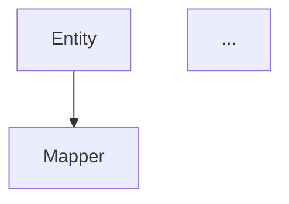

## 阶段五：Task Split（任务拆分）

### 🔔 入口 Banner（本阶段开始时输出）

```
▶ Task Split（任务拆分）
════════════════════════════════════
目标：将设计方案拆分为可执行任务，建立 DAG 依赖图
输出：task-breakdown.yaml
模式：L2 / L3
预计：3-8 分钟
════════════════════════════════════
```

### 触发条件
- 全流程模式（Design 确认后）
- 用户输入 `/dev-flow -split`

### 🔴🔴 主 Agent 零编辑约束（本阶段入口铁律）

> **⚠️ 最高优先级**：主 Agent 在本阶段的唯一角色是**调度器**。
> **主 Agent 绝对禁止直接使用 Edit/Write 工具编辑本阶段的任何产出文件。**
> **所有文件编辑必须由 task-split-expert subagent 执行。**
> **完整零编辑铁律、失败硬阻断规则、交付物协议见 `references/protocol.md`。**

### 入口前检查：阶段门禁

> **完整门禁检查流程见 `references/protocol.md` — 阶段门禁检查章节。**
> **快速检查**：`.dev-flow/stage-confirmations/{需求简称}/design.confirmed` 必须存在。

### 目的
将详细设计拆分为精确的开发任务，解决依赖关系，确定并行/串行执行顺序，为后续并行开发做准备。

### 拆分维度选择

> **根据需求复杂度自动选择最合适的拆分维度。**

| 拆分维度 | 切分方式 | 适用场景 | 任务粒度 |
|---------|---------|---------|---------|
| **代码层维度**（默认） | 按代码分层拆分：Entity → DTO → Mapper → Service → Controller | 简单 CRUD、单服务需求 | 粗（每个任务 = 一层代码） |
| **功能维度** | 按业务功能拆分：每个任务 = 一个完整功能的端到端实现 | 复杂业务逻辑、多功能点需求 | 细（每个任务 = 一个功能） |

**自动选择规则**：

```
Step 0: 选择拆分维度
  │
  ├── 功能点 ≤ 3 且 单服务
  │     └── 代码层维度（默认）
  │     └── 任务按 Entity → DTO → Mapper → Service → Controller 拆分
  │
  ├── 功能点 > 3 或 多服务 或 功能间有数据交互
  │     └── 功能维度
  │     └── 每个功能点独立成任务，包含该功能的完整代码实现
  │
  └── 用户显式指定 → 使用指定维度
```

**代码层维度拆分示例**（简单需求）：

```
功能：新增用户 CRUD

任务拆分（代码层维度）：
  Task-1: 新增 UserEntity（无依赖）
  Task-2: 新增 UserRequestDTO / UserResponseDTO（依赖 Task-1）
  Task-3: 新增 UserMapper（依赖 Task-1）
  Task-4: 新增 UserService 接口 + 实现类（依赖 Task-2, Task-3）
  Task-5: 新增 UserController（依赖 Task-4）
```

**功能维度拆分示例**（复杂需求）：

```
功能：用户管理模块（含 CRUD + 角色分配 + 密码重置）

任务拆分（功能维度）：
  Task-1: 用户 CRUD 功能端到端实现
    - 包含：UserEntity, UserDTO, UserMapper, UserService, UserController
    - 依赖：无（基础功能）

  Task-2: 角色分配功能端到端实现
    - 包含：UserRoleEntity, RoleDTO, UserRoleService, RoleController
    - 依赖：Task-1（需要 UserEntity）

  Task-3: 密码重置功能端到端实现
    - 包含：PasswordResetDTO, PasswordResetService, PasswordResetController
    - 依赖：Task-1（需要 UserService）
```

> **选择功能维度时，Step 2（依赖图）和 Step 2.5（冲突检测）仍然必须执行**，
> 以确保不同功能任务之间的 Entity 引用和 Service 调用不会冲突。

### 执行步骤

> **⚠️ 以下步骤由 task-split-expert subagent 在独立上下文中执行，主 Agent 不直接执行这些步骤。主 Agent 的职责是：创建 subagent → 传递上下文 → 等待结果 → 向用户汇报。**

**Step 1: 读取详细设计文档**
- 读取 `.dev-flow/deliverables/{需求简称}/03-design-result.md`
- 提取所有需要新增/修改的文件列表
- 识别每个文件的依赖关系

**Step 2: 构建任务依赖图（DAG）**

> **🔴 任务粒度量化规则（必须遵循）**：

| 约束维度 | 上限 | 说明 |
|---------|------|------|
| 每个任务新增/修改文件数 | ≤ 3 | 超过 3 个文件的任务必须拆分 |
| 每个任务预估代码行数 | ≤ 200 行 | 超过 200 行的任务必须拆分 |
| 每个任务依赖深度 | ≤ 3 层 | 依赖链超过 3 层需检查是否存在不必要的串行 |
| 同批次最大任务数 | ≤ 平台并行上限 | Cursor: 10, Claude: 16, Trae: 5, Codex: 6, Qoder: 4 |

**粒度自检**：拆分完成后，逐项检查每个任务是否满足上述约束。不满足的必须进一步拆分。

**🔴 任务域标签（domain）**：

每个任务必须标记 `domain` 字段，用于 Develop 阶段的域路由调度：

| 文件类型 | domain |
|---------|--------|
| `.java`, `.go`, `.py`, `.rs` 文件 | `backend` |
| `.tsx`, `.jsx`, `.vue`, `.svelte` 文件 | `frontend` |
| `.ts` 文件 | 根据目录和内容判断：`src/api/` → `frontend`，`src/**/*.service.ts`（NestJS）→ `backend` |
| `.css`, `.scss`, `.less`, `.module.css` | `frontend` |
| `.xml`, `.yml`, `.properties` | `backend` |
| SQL 文件 | `backend` |
| 配置文件（Docker/CI/部署） | `backend` |

**domain 判定规则**：
- 单文件任务：根据文件扩展名直接判定
- 多文件任务：取主要文件的 domain（如 Entity+DTO+Service → backend）
- 跨域任务（极少）：拆分为两个独立任务，分别标记 domain

对每个开发任务分析：
- **输入依赖**：该任务需要哪些其他任务的输出（如 Entity → Service → Controller）
- **数据依赖**：该任务需要哪些公共模块的数据（如 common-bean 的 Entity）
- **接口依赖**：该任务需要调用哪些其他服务的接口（如 Feign Client）

**依赖分析规则**：

| 任务类型 | 必须先完成的任务 |
|----------|-----------------|
| Entity | 无（可并行） |
| Enum | 无（可并行） |
| DTO | Entity（如果引用 Entity） |
| Mapper | Entity |
| Service 接口 | Entity, DTO |
| Service 实现 | Mapper, DTO, Feign Client |
| Feign Client | 无（可并行，但需目标服务已定义） |
| Controller | Service, DTO |
| Config | 无（可并行） |

**Step 2.5: 文件冲突检测（🔴 必须执行）**

> **目的**：检测并行任务之间的文件读写冲突，防止多 Agent 同时修改同一文件导致数据丢失。

**检测流程**：

```
Step 2.5.0: 识别跨服务共享文件（🔴 必须先执行）

  在冲突检测前，先识别所有跨服务/公共模块的共享文件：
  - 从 Research 阶段的 memory/公共模块.md 中提取所有公共模块路径
  - 从 design-contract.yaml 中识别被多个服务/功能引用的公共类
  - 生成 shared_files 清单（含：common-bean、公共 DTO、公共 Enum、基础 Config 等）

  共享文件分类：
  ├── 引用型共享：多任务读取但无需修改 → 🟢 无冲突（仅 read）
  └── 修改型共享：至少一个任务需要修改 → 🔴 必须强制声明到 write_files

Step 2.5.1: 声明每个任务的文件操作集合

 对每个任务，声明：
   read_files: [该任务需要读取的文件列表]
   write_files: [该任务需要创建或修改的文件列表]

   🔴 强制声明规则（跨服务共享文件）：
   ├── 如果任务需要修改任何 shared_files 中的文件 → 必须显式列入 write_files
   ├── 如果任务新增的类继承了公共模块的类（如 extends BaseEntity） → BaseEntity 模块路径列入 read_files
   ├── 如果任务新增的 DTO 引用了公共枚举 → 公共枚举模块路径列入 read_files
   └── 未声明的共享文件修改将被视为遗漏，Step 2.5.2 会自动扫描补充

Step 2.5.2: 构建文件冲突矩阵

 对同一批次内所有任务对 (Ti, Tj) 执行冲突检测：

   冲突检测规则：
   ├── Ti.write ∩ Tj.write ≠ ∅  → 🔴 写写冲突 → 必须串行（Ti 先于 Tj）
   ├── Ti.write ∩ shared_files 且 Tj.write ∩ shared_files ≠ ∅
   │     → 🔴 跨服务写写冲突 → 两个任务必须串行，且共享文件归并到一个任务
   ├── Ti.write ∩ Tj.read ≠ ∅  → 🟡 写读约束 → Ti 先于 Tj
   ├── Ti.read ∩ Tj.write ≠ ∅  → 🟡 读写约束 → Tj 先于 Ti
   └── Ti.read ∩ Tj.read ≠ ∅   → 🟢 无冲突   → 可并行

   🔴 跨服务冲突自动扫描：
   如果 task-split-expert 声明的 write_files 中未包含 shared_files 中的任何条目，
   但 design-contract.yaml 中有跨服务引用 → 自动将共享文件追加到相关任务的 write_files，
   并在冲突报告中标注 "自动补充"。

Step 2.5.3: 修正 DAG 依赖图

   将冲突检测结果转化为额外依赖边：
   - 写写冲突：Ti → Tj（Ti 必须在 Tj 之前完成）
   - 写读约束：Ti → Tj（Ti 必须在 Tj 之前完成）
   - 读写约束：Tj → Ti（Tj 必须在 Ti 之前完成）
   - 跨服务写写冲突：Ti → Tj，且将共享文件写入合并到先执行的任务中

Step 2.5.4: 重新拓扑排序

   在修正后的 DAG 上重新执行拓扑排序，生成最终的批次划分
```

**冲突检测输出**：

```yaml
# task-breakdown.yaml 中新增 conflicts 字段
shared_files:
  - path: "common-bean/src/main/java/com/common/BaseEntity.java"
    type: "shared-entity"
    referenced_by: ["Task-1", "Task-5", "Task-8"]
    modified_by: []  # 无人修改，仅为引用型共享
  - path: "common-bean/src/main/java/com/common/StatusEnum.java"
    type: "shared-enum"
    referenced_by: ["Task-1", "Task-3"]
    modified_by: ["Task-3"]  # Task-3 需新增枚举值
conflicts:
  - task_a: "Task-5"    # 新增 XxxMapper.xml
    task_b: "Task-6"    # 新增 XxxMapper (Java)
    conflict_type: "write-write"
    file: "XxxMapper"
    resolution: "Task-5 先于 Task-6"
  - task_a: "Task-3"    # 修改 StatusEnum（新增枚举值）
    task_b: "Task-7"    # 引用 StatusEnum
    conflict_type: "cross-service-write-read"
    file: "common-bean/.../StatusEnum.java"
    resolution: "Task-3 先于 Task-7"
    auto_supplemented: true  # 共享文件自动扫描补充
```

**冲突检测报告**：

```markdown
### 文件冲突检测结果

#### 共享文件识别
| 共享文件 | 引用任务 | 修改任务 | 类型 |
|---------|---------|---------|------|
| common-bean/.../BaseEntity.java | Task-1, Task-5, Task-8 | 无 | 引用型 |
| common-bean/.../StatusEnum.java | Task-1, Task-3, Task-7 | Task-3 | 修改型 |

#### 冲突矩阵
| 任务 A | 任务 B | 冲突类型 | 冲突文件 | 解决方案 |
|--------|--------|---------|---------|---------|
| Task-5 | Task-6 | 🔴 写写 | XxxMapper.xml | Task-5 先执行 |
| Task-3 | Task-7 | 🔴 跨服务写读 | StatusEnum.java | Task-3 先执行（自动补充） |

**冲突修正后**：原批次 1 的 Task-3 被移至批次 2
```

**Step 3: 划分执行批次**

根据依赖图，将任务划分为多个批次：

```
批次 1（可并行）：
  - Task-1: 新增 XxxEntity
  - Task-2: 新增 XxxEnum
  - Task-3: 新增 XxxConfig
  - Task-4: 新增 XxxFeignClient

批次 2（批次 1 完成后可并行）：
  - Task-5: 新增 XxxMapper
  - Task-6: 新增 XxxDTO

批次 3（批次 2 完成后可并行）：
  - Task-7: 新增 XxxService 接口
  - Task-8: 新增 XxxServiceImpl

批次 4（批次 3 完成后）：
  - Task-9: 新增 XxxController
```

**Step 4: 生成任务清单**

为每个任务生成详细描述：

| 任务ID | 任务名称 | 文件路径 | 依赖任务 | 批次 | 域(domain) | 预估复杂度 |
|--------|----------|----------|----------|------|-----------|
| Task-1 | 新增不合格品实体 | entity/NonConformingProduct.java | 无 | 1 | 低 |
| Task-2 | 新增处置类型枚举 | enums/DispositionType.java | 无 | 1 | 低 |
| ... | ... | ... | ... | ... | ... |

**Step 5: 输出任务拆分文档**

> **🔴 必须输出正式文档**：将任务拆分结果写入独立文档文件。

```markdown
# 任务拆分：{需求标题}

<!-- last-updated: YYYY-MM-DD HH:mm -->

## 1. 任务总览
| 维度 | 数量 |
|------|------|
| 总任务数 | X |
| 批次数 | X |
| 可并行任务 | X |
| 串行任务 | X |

## 2. 依赖关系图
```mermaid
graph TD
    Task-1[Entity] --> Task-5[Mapper]
    Task-1 --> Task-7[Service]
    Task-5 --> Task-8[ServiceImpl]
    Task-7 --> Task-8
    Task-8 --> Task-9[Controller]

## 3. 执行批次

### 批次 1（可并行执行）
| 任务ID | 任务名称 | 文件路径 | 复杂度 | 负责 Subagent |
|--------|----------|----------|--------|---------------|
| Task-1 | ... | ... | 低 | @develop-expert-1 |
| Task-2 | ... | ... | 低 | @develop-expert-2 |

### 批次 2（批次 1 完成后执行）
| 任务ID | 任务名称 | 文件路径 | 依赖任务 | 复杂度 |
|--------|----------|----------|----------|--------|

## 4. 任务详情

### Task-1: 新增不合格品实体
- **文件路径**：`src/main/java/.../entity/NonConformingProduct.java`
- **依赖任务**：无
- **所属批次**：1
- **预估复杂度**：低
- **实现要点**：
  - 继承 BaseEntity
  - 包含字段：recordCode, batchNo, productId, dispositionType, status
  - 使用 @TableName 注解

## 5. 并行开发建议
- 建议使用 3-4 个 develop-expert subagent 并行开发
- 每个 subagent 负责一个批次的多个任务
- 主 Agent 负责协调和汇总
```

**Step 6: 派发任务给主 Agent**

输出任务清单后，主 Agent 根据批次顺序和域路由调度 develop-expert subagent：
- 同一批次的任务可并行派发给多个 subagent
- `domain: "backend"` 的任务派发给 backend-develop-expert
- `domain: "frontend"` 的任务派发给 frontend-develop-expert
- 跨域依赖（前端任务依赖后端 API）→ 后端任务先完成，前端任务再启动
- 下一批次需等待上一批次全部完成
- 每个 subagent 完成后向主 Agent 汇报

---

### 高级模式：单文件单 Agent（极端拆分）

> **适用场景**：超大型项目（>30 个文件）、上下文极度受限环境
> **核心思想**：每个文件由一个独立的 develop-expert 生成，彻底避免上下文累积

**模式触发条件**：
```
- 总文件数 > 30，或
- 单个文件预估代码量 > 500 行，或
- 用户显式指定：/dev-flow -subagent -extreme
```

**执行流程**：

```
Task Split 阶段输出（极端模式）：

任务清单（每个任务只包含一个文件）：
| 任务ID | 文件类型 | 文件路径 | 依赖 | 预估上下文 |
|--------|----------|----------|------|-----------|
| T-001 | Entity | User.java | 无 | 5KB |
| T-002 | DTO | UserRequestDTO.java | T-001 | 3KB |
| T-003 | DTO | UserResponseDTO.java | T-001 | 3KB |
| ... | ... | ... | ... | ... |

主 Agent 调度（串行执行，每个任务独立上下文）：

  1. 派发 T-001 → @develop-expert-001
     - 输入：User.java 的需求描述 + conventions.md
     - 输出：User.java 文件
     - 完成后立即释放上下文

  2. 派发 T-002 → @develop-expert-002
     - 输入：UserRequestDTO.java 需求 + conventions.md + User.java（已生成）
     - 输出：UserRequestDTO.java 文件
     - 完成后立即释放上下文

  3. 以此类推...
```

**优势**：
- 每个 agent 上下文占用固定（<10KB）
- 彻底消除多文件累积风险
- 适合超大型需求和长流程开发

**劣势**：
- 调度开销增加（任务切换次数多）
- 总执行时间可能延长（无法利用批次内并行）
- 不适合文件间强耦合的场景

**建议**：仅在标准 Subagent 模式仍出现上下文问题时启用

---

### 智能负载均衡（动态任务分配）

> **适用场景**：多 develop-expert 并行开发时，动态分配任务以平衡负载

**负载评估指标**：
| 指标 | 说明 | 权重 |
|------|------|------|
| 文件复杂度 | 简单/中等/复杂 | 40% |
| 依赖深度 | 依赖链长度 | 30% |
| 预估代码量 | 行数估算 | 30% |

**分配策略**：
```
初始化：
  - 可用 agents: [@dev-1, @dev-2, @dev-3]
  - 每个 agent 负载: 0

分配算法（贪心）：
  1. 计算每个未分配任务的负载值
  2. 选择负载值最高的任务
  3. 分配给当前负载最低的 agent
  4. 更新 agent 负载
  5. 重复直到所有任务分配完成

动态调整：
  - 如果某个 agent 执行超时，将其任务转移到其他 agent
  - 如果新 agent 加入，重新平衡负载
```

**Step 6.5: 写入结构化任务文件（供 Develop 阶段使用）**

> **目的**：生成机器可读的结构化任务文件，供 Develop 阶段的 Orchestrator 读取和调度。

**写入路径**：`.dev-flow/contracts/{需求简称}/task-split/task-breakdown.yaml`

```yaml
# task-breakdown.yaml — 任务拆分结构化文件
# 路径: .dev-flow/contracts/{需求简称}/task-split/task-breakdown.yaml
# 生成者: task-split-expert subagent
# 使用者: Develop 阶段的 Orchestrator、backend-develop-expert、frontend-develop-expert

meta:
  version: "1.0"
  generated_by: "task-split-expert"
  timestamp: "2026-06-12T10:00:00"
  requirement_name: "{需求标题}"
  requirement_id: "{需求简称}"

summary:
  total_tasks: 8
  total_batches: 4
  parallel_tasks: 6
  sequential_tasks: 2
  split_dimension: "功能维度"  # 代码层维度 / 功能维度
  development_mode: "subagent"  # subagent / serial

# 任务清单
tasks:
  - id: "Task-1"
    name: "新增 UserEntity"
    domain: "backend"
    type: "EntityTask"
    files:
      - "src/main/java/com/xxx/entity/User.java"
    dependencies: []
    batch: 1
    complexity: "低"
    assigned_agent: "backend-develop-expert"

  - id: "Task-2"
    name: "新增 UserMapper"
    domain: "backend"
    type: "MapperTask"
    files:
      - "src/main/java/com/xxx/mapper/UserMapper.java"
      - "src/main/resources/mapper/UserMapper.xml"
    dependencies: ["Task-1"]
    batch: 2
    complexity: "低"
    assigned_agent: "backend-develop-expert"

# 共享文件清单
shared_files:
  - path: "common-bean/src/main/java/com/common/BaseEntity.java"
    type: "shared-entity"
    referenced_by: ["Task-1", "Task-5"]
    modified_by: []

# 冲突检测结果
conflicts:
  - task_a: "Task-5"
    task_b: "Task-6"
    conflict_type: "write-write"
    file: "XxxMapper"
    resolution: "Task-5 先于 Task-6"

# 批次划分
batches:
  - batch: 1
    tasks: ["Task-1", "Task-2", "Task-3", "Task-4"]
  - batch: 2
    tasks: ["Task-5", "Task-6"]
```

**写入路径**：`.dev-flow/contracts/{需求简称}/task-split/task-dag.yaml`

```yaml
# task-dag.yaml — 任务依赖 DAG
# 路径: .dev-flow/contracts/{需求简称}/task-split/task-dag.yaml
# 生成者: task-split-expert subagent
# 使用者: Develop 阶段的 Orchestrator（开发模式判定、批次调度）

meta:
  version: "1.0"
  generated_by: "task-split-expert"
  timestamp: "2026-06-12T10:00:00"

dag:
  nodes:
    - id: "Task-1"
      name: "UserEntity"
      type: "EntityTask"
      domain: "backend"
    - id: "Task-2"
      name: "UserMapper"
      type: "MapperTask"
      domain: "backend"
      dependencies: ["Task-1"]

  batches:
    - batch: 1
      tasks: ["Task-1"]
    - batch: 2
      tasks: ["Task-2"]

  metrics:
    total_tasks: 8
    write_conflicts: 2
    dag_depth: 4
    batch_count: 4
```

---

**Step 7: 🔴 生成阶段交付物（v3.1 新增）**

> **目的**：生成独立的阶段交付物文档，供主 Agent 打开给用户审阅。

**交付物路径**：`.dev-flow/deliverables/{需求简称}/04-task-breakdown.md`

**交付物内容**：
```markdown
<!-- @generated-by: task-split-expert subagent | session: {session-id} | stage: task-split -->

# 任务拆分报告：{需求标题}

<!-- last-updated: YYYY-MM-DD HH:mm -->
<!-- status: task-split -->

## 1. 任务总览
| 维度 | 数量 |
|------|------|
| 总任务数 | X |
| 批次数 | X |
| 可并行任务 | X |
| 串行任务 | X |
| 拆分维度 | 代码层 / 功能维度 |

## 2. 依赖关系图


## 3. 执行批次
| 批次 | 任务ID | 任务名称 | 文件路径 | 依赖 | 域 | 复杂度 |
|------|--------|----------|----------|------|--------|
| 1 | Task-1 | ... | ... | 无 | 低 |
| 1 | Task-2 | ... | ... | 无 | 低 |
| 2 | Task-3 | ... | ... | Task-1 | 中 |

## 4. 文件冲突检测结果
| 任务 A | 任务 B | 冲突类型 | 冲突文件 | 解决方案 |
|--------|--------|---------|---------|---------|

## 5. 开发模式推荐
- 推荐模式：{模式}
- 判定依据：任务数 X，写写冲突 X，DAG 深度 X，批次 X
- 并行 Subagent 数建议：{数量}

## 6. 任务详情
（每个任务/批次的详细描述）
```

**自检**：
- 交付物文件已生成且内容非空
- 包含 `@generated-by: task-split-expert subagent` 溯源注释
- 所有任务已分配 ID 和批次
- 冲突检测结果已记录
- 开发模式推荐已显式标注

**暂停，等待用户确认任务拆分方案。**

---

### ✅ 阶段确认清单

| # | 确认项 | 状态 |
|---|--------|------|
| 0 | **执行者审计**：本阶段由 task-split-expert subagent 执行，主 Agent 未直接编辑任何文件 | ⬜ 待确认 |
| 1 | 所有设计文档中的文件都已纳入任务清单 | ⬜ 待确认 |
| 2 | 任务依赖关系（DAG）正确无遗漏 | ⬜ 待确认 |
| 3 | 文件冲突检测结果已处理（无写写冲突残留） | ⬜ 待确认 |
| 3.5 | **跨服务共享文件已全部识别并声明**：shared_files 清单完整，修改型共享已归并到单一任务 | ⬜ 待确认 |
| 4 | 拆分维度选择合理（代码层/功能维度） | ⬜ 待确认 |
| 5 | 并行/串行执行顺序符合实际开发约束 | ⬜ 待确认 |
| 6 | 每个任务的负责 Subagent 已分配 | ⬜ 待确认 |
| 6.5 | **任务域标签已正确标记**：所有任务的 domain 字段（frontend/backend）已根据文件类型正确判定 | ⬜ 待确认 |
| 7 | **开发模式选择**（🔴 自动判定，见下方规则） | ⬜ 待确认 |

**🔴 确认项 #7 开发模式自动判定规则**：

> 在 Task Split 确认后、Develop 阶段进入前，系统基于实际任务数据自动判定开发模式。
> 判定结果将作为确认清单的一部分展示给用户。

```
读取 task-dag.yaml，计算以下指标：
  ├── 任务总数 (total_tasks)
  ├── 写写冲突数 (write_conflicts)
  ├── DAG 最大依赖深度 (dag_depth)
  └── 拓扑排序批次数 (batch_count)

判定逻辑：
  ├── 满足以下任一 → 推荐且默认使用 Subagent 模式（Orchestrator 调度并行 subagent）
  │     ├── total_tasks > 5
  │     ├── write_conflicts > 0
  │     ├── dag_depth > 3
  │     └── batch_count > 3
  │
  └── 全部不满足 → 推荐串行 Subagent 调度（主 Agent 串行创建单个 develop-expert）
```

**确认项 #7 展示格式**：

```
| 7 | 开发模式：Subagent 模式（推荐） | 任务数 22 > 5，存在写写冲突 |
  或
| 7 | 开发模式：标准模式 | 任务数 3，无冲突，可直接开发 |
```

**用户操作**：确认无误 → 回复 "确认" 进入 Develop 阶段；需要修改 → 指出具体问题

> **阶段确认机制和交付物协议详见 `references/protocol.md`。**
