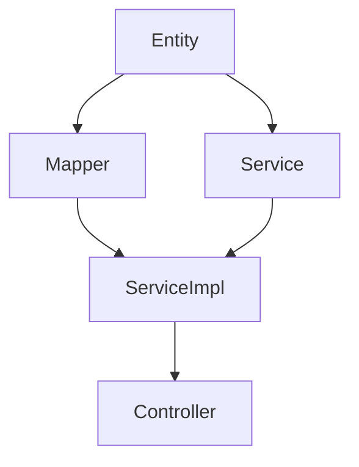

# dev-flow - AI开发全流程编排

## 定位

你是一个结构化的开发流程编排系统。当用户输入 `/dev-flow <需求>` 时，你将严格按照本技能定义的阶段、步骤和规范执行开发任务。

**核心价值**：让 AI 编程工具按结构化流程工作，避免遗漏步骤，确保产出质量。

## 使用方式

| 命令 | 说明 |
|------|------|
| `/dev-flow <需求描述>` | 全流程：Research → Analyze → Design → Task Split → Develop → Unit Test → Smoke Test → Integration Test → Delivery |
| `/dev-flow -subagent <需求描述>` | Subagent 模式：主 agent 协调，各阶段由专业 subagent 独立执行 |
| `/dev-flow -research` | 仅执行项目调研 |
| `/dev-flow -analyze <需求>` | 仅执行需求分析 |
| `/dev-flow -design <需求>` | 仅执行详细设计 |
| `/dev-flow -split <需求>` | 仅执行任务拆分 |
| `/dev-flow -develop <需求>` | 直接开发（跳过设计和拆分） |
| `/dev-flow -test` | 生成单元测试并执行 |
| `/dev-flow -smoke` | 执行冒烟测试 |
| `/dev-flow -integration` | 执行集成测试 |
| `/dev-flow -delivery` | 生成交付报告 |
| `/dev-flow -fix` | 分析并修复 Bug |
| `/dev-flow -hotfix <错误信息>` | 紧急修复线上错误 |
| `/dev-flow --resume` | 从上次中断处继续 |

## 运行模式

### 模式选择

dev-flow 支持两种运行模式：

| 模式 | 触发命令 | 适用场景 |
|------|----------|----------|
| **标准模式** | `/dev-flow <需求>` | 简单需求、单服务项目、快速开发 |
| **Subagent 模式** | `/dev-flow -subagent <需求>` | 复杂需求、多服务项目、大型重构 |

### Subagent 模式

当使用 `-subagent` 参数时，主 agent 作为协调者，不直接读取源码、不直接生成代码，而是调度专业 subagent 执行各阶段任务。

**架构**：
```
用户 ←→ 主 Agent（协调者）
              │
              ├── /research-expert  → 扫描项目，输出 memory/
              │     ├── @dependency-scanner   → 深层扫描依赖项目
              │     ├── @service-scanner      → 扫描当前服务
              │     ├── @structure-analyzer   → 分析项目结构
              │     └── @config-analyzer      → 分析配置规范
              ├── /analyze-expert   → 分析需求，输出需求分析文档
              ├── /design-expert    → 详细设计，输出设计文档
              ├── /task-split       → 任务拆分，输出任务清单（DAG）
              ├── /develop-expert   → 代码开发（可并行多个）
              │     ├── 开发中汇报机制 → 向主 Agent 汇报进度
              │     ├── @on-demand-loader → 按需加载未扫描的类
              │     └── @runtime-state-manager → 状态持久化、断点续传
              ├── /verify-expert    → 单元测试，输出测试报告
              ├── /smoke-test       → 冒烟测试，输出冒烟测试报告
              ├── /integration-test → 集成测试，输出集成测试报告
              └── /delivery         → 生成交付报告
```

**工作流程**：
1. 主 agent 接收需求，创建会话目录 `.dev-flow/sessions/{session-id}/`
2. 主 agent 按顺序调度 subagent：Research → Analyze → Design → Develop → Verify
3. 每个 subagent 在独立上下文中执行，只读取必要的文件
4. Develop 阶段根据任务拆分可并行启动多个 develop-expert
5. 主 agent 收集各 subagent 结果，整合后向用户汇报

**任务拆分与依赖处理**：
- Analyze 阶段输出的 `task-breakdown.yaml` 定义所有开发任务及其依赖关系
- 主 agent 根据 DAG 依赖图进行拓扑排序，分批执行
- 无依赖的任务并行执行（如不同服务的开发任务）
- 有依赖的任务串行执行（如 Entity → DTO → Service → Controller）

**Subagent 通信**：
- 通过文件系统传递信息（task-context.yaml / task-result.yaml）
- 主 agent 只保留任务状态，详细内容外置到文件
- 详见 `.dev-flow/agents/task-protocol.md`

**何时使用 Subagent 模式**：
- 需求涉及 2 个以上服务/模块
- 预计生成 10 个以上文件
- 项目代码量大（上下文可能不足）
- 需要并行开发加速

---

## ⚠️ 上下文管理（关键！必须阅读）

### 上下文溢出风险警告

> **⚠️ 重要提示**：AI 模型有上下文限制（通常 100-200K tokens，约 100-150KB 代码）。超出限制会导致：
> - 代码生成不完整（出现 `// TODO` 占位符）
> - 项目扫描缺失（部分文件未被读取）
> - 需求理解错误（关键信息被截断）

### 风险场景识别

| 风险等级 | 场景 | 触发条件 |
|---------|------|----------|
| 🔴 **高** | 标准模式处理多文件 | 需求涉及 >5 个文件 |
| 🔴 **高** | Research 扫描大项目 | 项目 >200 个文件 |
| 🟡 **中** | 复杂需求分析 | 涉及 3+ 服务，10+ 功能点 |

### 强制模式选择规则

**执行前必须检查**：

```
Step 0: 检测需求规模
  │
  ├── 预估文件数 ≤ 5 且 复杂度 = 低
  │     └── ✅ 可以使用标准模式
  │
  ├── 预估文件数 > 5 或 复杂度 ≥ 中
  │     └── ⚠️ 强制使用 Subagent 模式
  │     └── 提示用户："需求涉及 X 个文件，建议使用 /dev-flow -subagent 以确保质量"
  │
  └── 预估文件数 > 10 或 项目 >200 文件
        └── 🚨 必须使用 Subagent 模式
        └── 标准模式将被禁用
```

### 上下文监控机制

**实时监控**：
- **70% 使用**：警告提示，建议保存进度
- **85% 使用**：强制保存，触发分段执行
- **95% 使用**：立即停止，防止数据丢失

**自动保护措施**：
1. 达到 85% 时自动保存所有已生成内容到文件系统
2. 清理 AI 上下文，只保留关键摘要
3. 标记检查点，支持断点续传

### 最佳实践

| 场景 | 推荐模式 | 说明 |
|------|---------|------|
| 简单 CRUD（1-3 文件） | 标准模式 | 快速开发 |
| 中等需求（4-5 文件） | 标准模式 | 注意监控上下文 |
| 复杂需求（6+ 文件） | **Subagent 模式** | 强制使用 |
| 大型重构 | **Subagent 模式** | 必须拆分任务 |
| 多服务联调 | **Subagent 模式** | 并行开发 |

---

## 全局规则

### 执行原则
1. **每个阶段完成后必须暂停，向用户展示成果并等待确认**
2. **生成任何代码前，必须先读取项目记忆和已有代码**
3. **所有代码必须完整可运行，禁止生成空壳**
4. **遵守项目已有的编码风格和架构模式**
5. **根据项目类型自动选择对应的技术栈执行路径**

### 项目类型检测

在 Research 阶段，根据以下特征检测项目类型：

| 检测特征 | 项目类型 | 技术栈 |
|----------|----------|--------|
| `pom.xml` 或 `build.gradle` | Java 后端 | Spring Boot / Java EE |
| `package.json` + `src/` 含 `.tsx/.jsx/.vue` | 前端 | React / Vue / Angular |
| `package.json` + `src/` 含 `.ts/.js` (无 JSX/Vue) | Node.js 后端 | Express / NestJS / Fastify |
| `pyproject.toml` 或 `requirements.txt` | Python | FastAPI / Django / Flask |
| `go.mod` | Go | Gin / Echo / Fiber |
| `Cargo.toml` | Rust | Axum / Actix-web |

**检测优先级**：Java > 前端 > Node.js > Python > Go > Rust

### 微服务架构检测

**当检测到 Java 项目时，进一步判断是否为微服务架构：**

**微服务根目录特征**（满足任一即判定为微服务）：
- 根目录下存在多个子目录，每个子目录都有独立的 `pom.xml`
- 根目录存在父级 `pom.xml`（`<packaging>pom</packaging>`），包含 `<modules>` 定义
- 存在多个服务目录（命名不限，通过内容分析识别角色）

**检测到微服务架构后，自动进入「多服务模式」：**
- 扫描所有子服务目录，识别每个服务的角色（网关/认证/业务/公共）
- 扫描每个服务的多模块结构（不硬编码模块名，自动发现）
- 扫描跨服务依赖关系（Feign Client、公共依赖）
- 建立服务间依赖图谱

**单服务模式 vs 多服务模式：**

| 维度 | 单服务模式 | 多服务模式 |
|------|-----------|-----------|
| 触发条件 | 当前目录有 `src/main/java` | 根目录有父级 `pom.xml` + 多个子服务 |
| 扫描范围 | 当前项目 | 所有子服务 |
| 记忆位置 | `.dev-flow/memory/` | `.dev-flow/memory/`（共享）+ 各服务 `.dev-flow/memory/` |
| 代码生成 | 当前项目 | 根据需求分析定位到具体服务的具体模块 |

### 禁止事项
- ❌ 生成 `// TODO: 实现业务逻辑` 等占位符
- ❌ 生成 `{/* 描述 */}` 等空 JSX（前端项目）
- ❌ 生成 `expect(true).toBe(true)` 等无效测试
- ❌ 返回硬编码的 `{ code: 0, data: null }` 或 `ApiResponse.success(null)`
- ❌ 跳过任何阶段（除非用户明确要求）
- ❌ 在未读取项目记忆的情况下生成代码

---

## 阶段一：Research（项目调研）

### 触发条件
- 全流程模式自动触发
- 用户输入 `/dev-flow -research` 或 `/dev-flow --refresh`

---

### 🔴 Step 0: 智能判断是否需要扫描（执行前必须先检查）

> **目的**：避免重复全量扫描。如果项目记忆已经是最新的，直接跳过或增量更新。

**检查流程**（按顺序执行）：

**1. 检查记忆目录是否存在**
- [ ] `.dev-flow/memory/` 目录存在？
  - **否** → 执行完整 Research（从 Step 1 开始）
  - **是** → 继续检查

**2. 检查关键文件是否存在且非空**

| 项目类型 | 必须存在的文件 |
|----------|---------------|
| 所有项目 | `project-overview.md`、`conventions.md` |
| Java 微服务 | `common-modules.md`、`dependency-graph.md`、`models.md` |
| Java 单服务 | `models.md`、`apis.md` |
| 前端/Node.js | `components.md`、`apis.md` |

- [ ] 所有关键文件都存在且内容 > 100 字符？
  - **否**（有文件缺失或为空）→ 执行完整 Research
  - **是** → 继续检查

**3. 检查记忆新鲜度**

读取任意一个 memory 文件的首行，检查是否包含时间戳标记 `<!-- last-updated: YYYY-MM-DD HH:mm -->`：

- [ ] 时间戳在 **24 小时内**？
  - **是** → **询问用户**：
    ```
    检测到有效的项目记忆（{时间}，{N}小时前），是否跳过 Research 直接开始 Analyze？
    - 跳过 Research（推荐，如果项目没有重大变更）
    - 增量更新（仅扫描变更的部分）
    - 重新全量扫描
    ```
  - **否** → 继续检查

- [ ] 时间戳在 **7 天内**？
  - **是** → **静默执行增量更新**（不询问用户，直接进入 Step 4 增量更新）
  - **否** → **询问用户**：
    ```
    项目记忆已过期（{时间}，{N}天前），建议重新扫描。是否重新执行 Research？
    - 重新全量扫描（推荐）
    - 仍然使用旧记忆（可能缺少最新变更）
    ```

**4. 检查项目配置变更（增量更新判断）**

对比项目配置文件的修改时间与 memory 文件的修改时间：
- Java 项目：对比 `pom.xml` 的修改时间
- 前端项目：对比 `package.json` 的修改时间

- [ ] 配置文件修改时间 **晚于** memory 文件修改时间？
  - **是** → 执行**增量更新**（Step 4）
  - **否** → 记忆有效，跳过 Research

**判断结果汇总**：

| 条件 | 操作 |
|------|------|
| 记忆不存在 | 执行完整 Research（Step 1-6） |
| 文件缺失/为空 | 执行完整 Research（Step 1-6） |
| 记忆 < 24h + 配置无变更 | **询问用户**是否跳过 |
| 记忆 < 7d + 配置有变更 | 静默增量更新 |
| 记忆 > 7d | **询问用户**是否重新扫描 |
| 用户选择跳过 | 直接进入 Analyze 阶段 |
| 用户选择增量更新 | 执行 Step 4 增量更新 |

---

#### Step 4: 增量更新（仅在需要时执行）

> **触发条件**：记忆存在但配置文件有变更，或用户选择增量更新。

1. 读取现有 memory 文件
2. 使用 Glob 扫描当前项目，对比 memory 中记录的文件列表
3. 识别**新增**、**修改**、**删除**的文件
4. 只扫描变更的部分：
   - 新增文件 → 读取并提取信息
   - 修改文件 → 重新读取并更新
   - 删除文件 → 从 memory 中移除
5. 合并更新到现有 memory 文件（保留未变更的内容）
6. 更新所有 memory 文件的时间戳标记

**时间戳格式**（写入每个 memory 文件首行）：
```markdown
<!-- last-updated: 2026-05-26 14:30 -->
```

---

### 🔴 必须按顺序执行的检查清单（完整扫描时执行）

> **规则**：以下每个步骤都必须完成，不能跳过。每完成一步打一个 ✅。如果某步无数据，必须写入"暂无数据"。

---

#### ✅ Step 1：检测项目类型和架构

- [ ] 读取项目根目录文件列表
- [ ] 检测项目类型（Java / 前端 / Node.js / Python / Go / Rust）
- [ ] 如果是 Java 项目，进一步检测是否为微服务：
  - 根目录有父 `pom.xml`（`<packaging>pom</packaging>`）且含 `<modules>` → **微服务（多服务模式）**
  - 当前目录有 `src/main/java` → **单服务模式**
- [ ] 如果是微服务：读取父 `pom.xml` 的 `<modules>`，列出所有子服务
- [ ] 对每个子服务读取其 `pom.xml`，识别角色（公共模块/网关/认证/业务）

---

#### ✅ Step 2：深层扫描依赖项目（🔴 最关键步骤，绝对不能跳过）

> **为什么关键**：后续开发需要依赖项目的 Entity/DTO/Enum/Util 才能生成正确代码。跳过此步 = 生成错误代码。

**操作方法**：

1. 读取当前服务的 `pom.xml`，找出所有 `<dependency>`
2. 区分两类依赖：
   - **项目内依赖**：`groupId` 与父 pom 的 `groupId` 一致 → 需要深层扫描
   - **第三方依赖**：`groupId` 为外部组织 → 记录到 config.md
3. **对每个项目内依赖，执行以下扫描**：

| 扫描类别 | Glob 模式 | 读取内容 |
|----------|-----------|----------|
| Entity | `**/entity/*.java`、`**/*Entity*.java` | 类名、表名(`@TableName`)、字段列表 |
| DTO | `**/dto/*.java` | 类名、字段列表 |
| Enum | `**/enums/*.java`、`**/*Enum.java` | 枚举名、所有枚举值 |
| Util | `**/util/*.java`、`**/utils/*.java` | 类名、方法签名 |
| Feign Client | `**/*Client.java`、`**/*Api.java` | 接口名、目标服务、方法签名 |
| Config | `**/config/*.java` | 配置类名、配置项 |

4. **分层扫描策略（防止上下文溢出）**：

   **第一层：Quick Scan（快速扫描）**
   - 只 Glob 文件路径，**不读取内容**
   - 记录：文件路径、文件名、修改时间
   - 输出：文件列表（占用上下文极小）
   - 目的：了解项目规模，为采样策略提供数据

   **第二层：Smart Sampling（智能采样）**
   - 根据文件类型和重要性，选择性深度读取
   - 采样规则：

   | 类别 | 最大读取数 | 采样策略 | 说明 |
   |------|-----------|----------|------|
   | Entity | 20 | 优先读取最近修改的 | 核心业务实体优先 |
   | DTO | 15 | 优先读取最近修改的 | 常用数据传输对象优先 |
   | Enum | 全部 | 全部读取（通常不多） | 枚举值必须完整 |
   | Util | 10 | 优先读取使用频率高的 | 常用工具类优先 |
   | Feign Client | 全部 | 全部读取（通常不多） | 跨服务接口必须完整 |
   | Config | 5 | 优先读取最近修改的 | 核心配置优先 |

   - 采样方法：
     ```
     1. 按修改时间排序（最近修改的优先）
     2. 按文件名关键字筛选（含 "Core"、"Base"、"Common" 的优先）
     3. 按引用关系筛选（被其他类引用的优先）
     4. 取前 N 个进行深度读取
     ```

   **第三层：On-Demand Loading（按需加载）**
   - 在 Develop 阶段发现需要未扫描的类时，触发增量扫描
   - 只读取需要的那个类，不重新扫描全部
   - 扫描结果缓存到 `.dev-flow/memory/on-demand-cache.yaml`

   **传统方式 vs 分层扫描对比**：
   ```
   传统方式（有风险）：
   - common-bean 有 100 个 Entity
   - 全部读取：100 × 5KB = 500KB
   - 结果：上下文溢出，后面 40 个 Entity 信息丢失

   分层扫描（安全）：
   - Quick Scan：100 个文件路径（5KB）
   - Smart Sampling：读取 20 个核心 Entity（100KB）
   - On-Demand：开发时需要其他 Entity 再读取
   - 结果：上下文占用 105KB，核心信息完整
   ```

5. **扫描执行流程**：
   ```
   Step 2.1: Quick Scan
     └── Glob 所有文件路径
     └── 统计各类别文件数量
     └── 判断是否超过阈值

   Step 2.2: Smart Sampling（如果文件数 > 阈值）
     └── 按采样规则选择文件
     └── 逐个 Read 前 80 行
     └── 提取类名、字段、注解

   Step 2.3: 记录扫描结果
     └── 已读取的文件：完整信息
     └── 未读取的文件：路径 + "未采样（按需加载）"
   ```

**示例**：
```
当前服务 qms-quality-management
  └── 依赖 qms-common-bean → Glob ../qms-common-bean/**/*.java → 提取 Entity/DTO/Enum/Util
  └── 依赖 qms-business-basedata-api → Glob ../qms-business-basedata/**/api/**/*.java → 提取 Feign Client/DTO
  └── 依赖 qms-workflow-api → Glob ../qms-workflow/**/api/**/*.java → 提取 Feign Client/DTO
```

---

#### ✅ Step 3：扫描当前服务源码

- [ ] 读取 `application.yml` / `bootstrap.yml`（端口、服务名、数据库、Redis、Nacos、中间件）
- [ ] 扫描当前服务各子模块的 Java 文件，按注解识别分层：
  - `@Entity` / `@TableName` → Entity
  - `@Service` → Service
  - `@RestController` / `@Controller` → Controller
  - `@Mapper` / `@Repository` → Mapper
  - `@Configuration` → Config
  - `@FeignClient` → Feign Client
  - 继承 `Enum` → Enum
- [ ] 扫描 `pom.xml` 中的中间件依赖（PowerJob、XXL-Job、RabbitMQ、Kafka、Redis、ES、MinIO 等）

---

#### ✅ Step 4：识别编码规范

- [ ] 从公共模块和现有代码中推断：
  - 命名风格（类名 PascalCase / 方法 camelCase / 常量 UPPER_SNAKE_CASE）
  - Lombok 使用（@Data, @Slf4j, @RequiredArgsConstructor）
  - ORM 框架（MyBatis-Plus / JPA）
  - 统一响应类（ResultDTO / ApiResponse / R）
  - 分页封装类（PageDTO / PageResult）
  - DTO 转换方式（MapStruct / BeanUtils / 手动）
  - 异常处理（BusinessException + @RestControllerAdvice）

---

#### ✅ Step 5：写入 memory 文件（🔴 每个文件必须有内容）

> **铁律**：每个文件必须写入具体内容。没有数据也要写"暂无数据"。空文件 = 执行失败。
> **时间戳**：每个文件首行必须写入时间戳标记 `<!-- last-updated: YYYY-MM-DD HH:mm -->`，用于 Step 0 智能判断。

**创建目录**：`.dev-flow/memory/`

**逐文件写入以下内容**：

| # | 文件名 | 必须包含的内容 | 不能为空 |
|---|--------|---------------|---------|
| 1 | `project-overview.md` | 技术栈、服务列表表格、目录结构 | ✅ |
| 2 | `service-registry.md` | 服务列表表格（服务名/目录/端口/角色/子模块/启动类）+ 跨服务调用关系表格 | ✅ |
| 3 | `dependency-graph.md` | Maven 依赖关系表格 + Feign 调用关系表格 + 依赖链路图（如 `quality → common-bean`） | ✅ |
| 4 | `common-modules.md` | **从 Step 2 深层扫描的结果**：每个依赖项目的 Entity/DTO/Enum/Util/Feign Client 表格，含完整类路径 | ✅ |
| 5 | `architecture.md` | 架构模式（微服务/单体）、服务角色（网关/业务服务/基础服务）、分层架构（Controller/Service/Mapper）、技术选型理由 | ✅ |
| 6 | `conventions.md` | 命名规范、注解使用、统一响应、异常处理、DTO 转换方式 | ✅ |
| 7 | `config.md` | 数据库/Redis/Nacos/中间件配置（从 application.yml 提取） | ✅ |
| 8 | `models.md` | 当前服务的 Entity 表格 + 依赖项目的 Entity 表格（从 Step 2 获取）+ DTO 表格 | ✅ |
| 9 | `apis.md` | 当前服务的 Controller API 表格 + 依赖服务的 Feign Client API 表格 | ✅ |
| 10 | `utils.md` | 当前服务工具类 + 依赖项目工具类（从 Step 2 获取） | ✅ |
| 11 | `decisions.md` | 架构决策表格（无则写"暂无已识别的架构决策，后续开发中持续记录"） | ✅ |
| 12 | `mistakes.md` | 常见错误（初始写"暂无记录，在 Fix 阶段和开发过程中持续积累"） | ✅ |
| 13 | `patterns.md` | 代码模式表格（无则写"暂无已识别的代码模式，后续开发中持续记录"） | ✅ |

**每个文件的格式要求**（以 common-modules.md 为例）：
```markdown
# 公共模块清单

## qms-common-bean

### Entity
| 类名 | 完整路径 | 表名 | 主要字段 |
|------|----------|------|----------|
| User | com.mom.common.bean.entity.User | sys_user | id, username, realName |

### DTO
| 类名 | 完整路径 | 主要字段 |
|------|----------|----------|
| PageDTO | com.mom.common.bean.dto.PageDTO | current, size |

### Enum
| 枚举名 | 完整路径 | 值 |
|--------|----------|-----|

### Util
| 类名 | 完整路径 | 方法 |
|------|----------|------|

## qms-business-basedata（API 模块）

### Feign Client
| 接口名 | 完整路径 | 目标服务 | 方法 |
|--------|----------|----------|------|
```

> **其他文件格式参照上述表格风格，使用 Markdown 表格组织信息。**

---

#### ✅ Step 6：自检（写完文件后立即执行）

> **如果任何一项不通过，返回对应步骤重新执行。**

- [ ] `common-modules.md` 包含依赖项目的类？（不能只有标题没有数据）
- [ ] `dependency-graph.md` 包含 Maven 依赖 + Feign 调用？
- [ ] `models.md` 包含当前服务和依赖服务的 Entity？
- [ ] `utils.md` 包含依赖项目的工具类？
- [ ] `apis.md` 包含 Feign Client API？
- [ ] `config.md` 包含数据库/Redis/中间件配置？
- [ ] `decisions.md` 和 `mistakes.md` 至少有"暂无"文字？
- [ ] 所有 12 个文件都已创建？

---

### 输出格式

完成所有步骤后，输出以下汇总表：

**Java 微服务（多服务模式）：**
| 维度 | 结果 |
|------|------|
| 项目类型 | Java 微服务（多服务模式） |
| 语言/版本 | Java XX |
| 框架 | Spring Boot X.X.X + Spring Cloud |
| 注册中心 | Nacos / Eureka / Consul |
| 网关 | Spring Cloud Gateway |
| 服务数量 | X 个 |
| 公共模块 | X 个 |
| 跨服务调用 | X 个 Feign Client |
| **依赖项目深层扫描** | **X 个（列出名称）** |
| 中间件 | 列出所有中间件 |
| 编码规范 | 从公共模块推断 |
| memory 文件 | 12/12 已写入 ✅ |

**Java 单服务项目：**
| 维度 | 结果 |
|------|------|
| 项目类型 | Java 后端 |
| 语言/版本 | Java XX |
| 框架 | Spring Boot X.X.X |
| ORM | MyBatis-Plus / JPA |
| 分层架构 | Controller / Service / Mapper / Entity / DTO / Enum / Config |
| Entity/Service/Controller 数量 | X / X / X |
| memory 文件 | 12/12 已写入 ✅ |

**前端项目：**
| 维度 | 结果 |
|------|------|
| 项目类型 | 前端 |
| 语言 | TypeScript / JavaScript |
| 框架 | React / Vue / Angular |
| 组件/API 数量 | X / X |
| memory 文件 | 12/12 已写入 ✅ |

**暂停，等待用户确认。**

---

## 阶段二：Analyze（需求分析）

### 触发条件
- 全流程模式（Research 确认后）
- 用户输入 `/dev-flow -analyze <需求>`

### 执行步骤

**Step 1: 需求解析**
- 识别需求类型：新功能 / 功能增强 / Bug 修复 / 重构 / 性能优化
- 识别优先级：P0(紧急) / P1(高) / P2(中) / P3(低)
- 提取核心功能点列表
- **如果是 Java 微服务（多服务模式）：**
  - 读取 `.dev-flow/memory/service-registry.md`，识别需求可能涉及的服务
  - 读取 `.dev-flow/memory/dependency-graph.md`，分析跨服务依赖影响
  - 评估跨服务影响范围：哪些服务会被直接影响，哪些会被间接影响（通过 Feign 调用链）

**Step 2: 上下文关联**
- 读取 `.dev-flow/memory/` 中的项目记忆
- **根据项目类型，识别与需求相关的已有代码：**

**如果是 Java 微服务（多服务模式）：**
- 读取 `.dev-flow/memory/service-registry.md` - 识别受影响的服务及其模块结构
- 读取 `.dev-flow/memory/dependency-graph.md` - 理解跨服务依赖关系和 Feign 调用链
- 读取 `.dev-flow/memory/common-modules.md` - 识别可复用的公共类（Entity/DTO/Enum/Util）
- 对每个受影响的服务：
  - 读取该服务的 `.dev-flow/memory/modules.md`（如有）或从 service-registry.md 获取模块信息
  - 识别相关的 Service、Mapper、Controller、Entity、DTO、Enum
  - 识别该服务中哪些具体模块需要变更
- 评估跨服务变更需求：
  - 是否需要新建 Feign Client 接口？（A 服务需要调用 B 服务的新方法）
  - 是否需要在公共模块中新增类？（多个服务共享的 Entity/DTO/Enum）
  - 是否需要修改现有 Feign Client？（增加新的跨服务调用方法）
  - 是否需要新增服务间的事件/消息通信？

**如果是 Java 单服务项目：**
- 读取 `modules.md` - 识别相关的 Service、Mapper、Controller、Entity、DTO、Enum
- 读取 `apis.md` - 识别需要新增或修改的 REST API 端点
- 读取 `models.md` - 识别相关的数据模型（Entity、DTO、数据库表）
- 读取 `config.md` - 识别相关的配置（数据库、Redis、消息队列等）
- 评估需求对现有代码的影响范围：
  - 是否需要新增 Entity/表？
  - 是否需要修改现有 Service 接口？
  - 是否需要新增 Controller 端点？
  - 是否需要新增或复用 DTO？
  - 是否需要新增 Enum？
  - 是否需要修改数据库配置或添加中间件？

**如果是前端项目：**
- 读取 `components.md` - 识别与需求相关的已有组件
- 读取 `apis.md` - 识别相关的 API 端点
- 读取 `models.md` - 识别相关的数据模型
- 评估需求对现有代码的影响范围

**Step 3: 歧义识别**
- 列出需求中不明确的地方
- 列出缺失的信息（如：认证方式未指定、错误处理策略未定义、数据库事务要求未明确）
- 向用户提问澄清

**Step 4: 生成需求文档**
输出格式：

**如果是 Java 微服务（多服务模式）：**
```markdown
## 需求分析：[需求标题]

### 基本信息
- 类型：新功能
- 优先级：P1
- 影响服务：[服务A]、[服务B]、[公共模块]

### 跨服务影响分析
| 服务 | 影响类型 | 说明 |
|------|----------|------|
| [服务A] | 直接影响 | 核心业务逻辑变更 |
| [服务B] | 间接影响 | 需要新增 Feign Client 方法 |
| common-bean | 公共模块 | 需要新增共享 DTO |

### 功能点
1. [功能点1] - 描述
2. [功能点2] - 描述
3. [功能点3] - 描述

### 约束条件
- [约束1]
- [约束2]

### 歧义/待确认
- [歧义1] → 建议：[建议方案]

### 相关已有代码
#### 公共模块
- [Entity/DTO/Enum 类名] - [说明可复用性]

#### 服务：[服务A]
##### Entity/数据模型
- [Entity 类名] - [说明关联关系]

##### Service 层
- [Service 接口名] - [说明需要新增或修改的方法]

##### Mapper 层
- [Mapper 接口名] - [说明是否需要新增查询方法]

##### Controller 层
- [Controller 类名] - [说明需要新增的端点]

##### DTO
- [DTO 类名] - [说明是否需要新增或复用]

##### Enum
- [Enum 类名] - [说明是否需要新增状态/类型枚举]

#### 服务：[服务B]
（同上结构）

### 跨服务调用变更
| 变更类型 | 调用方 | 被调用方 | Feign Client | 方法 | 说明 |
|----------|--------|----------|-------------|------|------|
| 新增 | 服务A | 服务B | XxxClient | xxxMethod() | 新增跨服务查询 |

### 预计新增/修改文件
| 服务 | 模块 | 类型 | 文件路径 | 操作 | 说明 |
|------|------|------|----------|------|------|
| common-bean | dto | DTO | `xxx/XxxDTO.java` | 新增 | 跨服务共享 DTO |
| 服务A | core | Entity | `xxx/Xxx.java` | 新增 | 对应 xxx 表 |
| 服务A | core | DTO | `xxx/XxxRequest.java` | 新增 | 请求参数 |
| 服务A | core | Mapper | `xxx/XxxMapper.java` | 新增 | 数据访问 |
| 服务A | core | Service | `xxx/XxxService.java` | 新增/修改 | 业务逻辑 |
| 服务A | manage | Controller | `xxx/XxxController.java` | 新增/修改 | REST API |
| 服务B | client | Feign | `xxx/XxxClient.java` | 新增/修改 | Feign 接口 |
```

**如果是 Java 单服务项目：**
```markdown
## 需求分析：[需求标题]

### 基本信息
- 类型：新功能
- 优先级：P1
- 影响范围：[列出受影响的文件/模块]

### 功能点
1. [功能点1] - 描述
2. [功能点2] - 描述
3. [功能点3] - 描述

### 约束条件
- [约束1]
- [约束2]

### 歧义/待确认
- [歧义1] → 建议：[建议方案]

### 相关已有代码
#### Entity/数据模型
- [Entity 类名] - [说明关联关系]

#### Service 层
- [Service 接口名] - [说明需要新增或修改的方法]

#### Mapper 层
- [Mapper 接口名] - [说明是否需要新增查询方法]

#### Controller 层
- [Controller 类名] - [说明需要新增的端点]

#### DTO
- [DTO 类名] - [说明是否需要新增或复用]

#### Enum
- [Enum 类名] - [说明是否需要新增状态/类型枚举]

### 预计新增/修改文件
| 类型 | 文件路径 | 操作 | 说明 |
|------|----------|------|------|
| Entity | `entity/Xxx.java` | 新增 | 对应 xxx 表 |
| DTO | `dto/XxxRequest.java` | 新增 | 请求参数 |
| Mapper | `mapper/XxxMapper.java` | 新增/修改 | 数据访问 |
| Service | `service/XxxService.java` | 新增/修改 | 业务逻辑 |
| Controller | `controller/XxxController.java` | 新增/修改 | REST API |
| Enum | `enums/XxxStatus.java` | 新增 | 状态枚举 |
```

**前端项目：**
```markdown
## 需求分析：[需求标题]

### 基本信息
- 类型：新功能
- 优先级：P1
- 影响范围：[列出受影响的文件/模块]

### 功能点
1. [功能点1] - 描述
2. [功能点2] - 描述
3. [功能点3] - 描述

### 约束条件
- [约束1]
- [约束2]

### 歧义/待确认
- [歧义1] → 建议：[建议方案]

### 相关已有代码
- 组件：[已有组件列表]
- API：[已有 API 列表]
- 模型：[已有模型列表]
```

**Step 5: 自检**
- 验证每个功能点是否都有对应的已有代码关联
- 验证影响范围是否完整覆盖所有受影响模块（Java 项目需覆盖 Entity/Mapper/Service/Controller/DTO/Enum）
- 验证歧义项是否都已提出澄清建议
- 验证预计文件列表是否符合项目分层架构规范
- **多服务模式额外验证**：
  - 是否所有受影响的服务都被识别到
  - 跨服务调用链是否完整（A → B → C 的间接依赖是否考虑）
  - 公共模块的变更是否会影响其他未识别的服务
  - Feign Client 变更是否与依赖图谱一致

**Step 6: 写入项目记忆并输出文档**

> **🔴 必须输出正式文档**：将需求分析结果写入独立文档文件，方便用户追溯。

**输出文档**：
- **正式文档**：`.dev-flow/docs/{需求简称}-需求分析.md`
- **会话记录**：追加到 `.dev-flow/sessions/` 当前会话文件

**文档命名规则**：需求简称取需求标题的前 20 个字符，去掉特殊字符，用 `-` 连接。例如"实现不合格品管理模块" → `实现不合格品管理模块-需求分析.md`

**文档模板**：
```markdown
# 需求分析：{需求标题}

<!-- last-updated: YYYY-MM-DD HH:mm -->
<!-- status: analyzed | approved | deprecated -->

## 1. 基本信息
| 项目 | 内容 |
|------|------|
| 需求标题 | {标题} |
| 需求类型 | 新功能 / 功能增强 / Bug 修复 / 重构 / 性能优化 |
| 优先级 | P0(紧急) / P1(高) / P2(中) / P3(低) |
| 分析时间 | YYYY-MM-DD HH:mm |
| 涉及服务 | {服务列表} |

## 2. 核心功能点
| # | 功能点 | 描述 | 优先级 |
|---|--------|------|--------|
| 1 | ... | ... | P0 |

## 3. 约束条件
- 技术约束：...
- 业务约束：...
- 兼容性约束：...

## 4. 相关已有代码
| 文件 | 说明 | 变更类型 |
|------|------|----------|
| ... | ... | 新增/修改/删除 |

## 5. 预计影响范围
- 直接影响：...
- 间接影响：...
- 风险点：...

## 6. 用户确认
- [ ] 用户已确认需求分析
```

**暂停，等待用户确认。**

---

## 阶段三：Design（详细设计）

### 触发条件
- 全流程模式（Analyze 确认后）
- 用户输入 `/dev-flow -design <需求>`

---

### ⚠️ 重要：Design 输出规范（必须遵守）

> **Design 阶段的所有输出必须遵循以下规范，否则 Develop 阶段无法正确解析。**

#### 3.1 Design 输出 JSON Schema

Design 阶段输出的所有设计必须包含以下结构化字段，用于 Develop 阶段自动解析：

**Entity 设计必须包含**：
```yaml
entity:
  className: "User"                    # 类名（必填）
  package: "com.xxx.entity"            # 包路径（必填）
  tableName: "t_user"                 # 数据库表名（必填）
  fields:
    - name: "id"                     # 字段名（必填）
      type: "Long"                   # Java 类型（必填，如 Long/String/byte/Integer）
      column: "id"                   # 数据库列名
      javaTypeNote: "使用包装类型 Long（可null），不用基本类型 long"  # 类型说明
    - name: "status"
      type: "byte"                   # ⚠️ 特殊类型必须标注
      javaTypeNote: "使用基本类型 byte，0=正常 1=禁用"
  getterSetterMethods:                 # ⚠️ 必须标注 getter/setter 方法名
    getId: "getUserId"               # 实际 getter 方法名
    getStatus: "getUserStatus"        # 实际 getter 方法名（含类名前缀）
    setStatus: "setUserStatus"        # 实际 setter 方法名
```

**⚠️ 字段类型规范（防止编译错误）**：
| Design 类型 | Java 类型 | 说明 |
|-------------|-----------|------|
| Long | `Long` | 包装类型，可为 null |
| long | `long` | 基本类型，不可为 null |
| byte | `byte` | 基本类型，赋值需 `(byte) 1` |
| Integer | `Integer` | 包装类型 |
| String | `String` | 字符串 |
| LocalDateTime | `LocalDateTime` | 日期时间 |

**⚠️ 方法命名规范（必须遵循项目实际命名）**：
- 必须通过读取已有 Entity 确认实际方法名
- 常见命名模式：`get{ClassName}{Field}()` 而非 `get{Field}()`
- 示例：`getUserStatus()` 而非 `getStatus()`

#### 3.2 Design → Develop 数据交换格式

Design 阶段完成后，生成标准交换文件 `.dev-flow/docs/{需求简称}-design-contract.yaml`：

```yaml
# Design Contract（设计契约）
# 此文件是 Design → Develop 的标准数据交换格式
# Develop 阶段必须读取此文件

contract_version: "1.0"
demand_name: "用户管理模块"
generated_at: "2026-05-29 14:00:00"
generated_by: "Design Expert"

# Entity 定义
entities:
  - name: "User"
    package: "com.xxx.entity"
    table: "t_user"
    fields:
      - name: "id"
        type: "Long"
        getter: "getUserId"
        setter: "setUserId"
      - name: "status"
        type: "byte"
        getter: "getUserStatus"
        setter: "setUserStatus"
        typeNote: "基本类型，赋值需 (byte) 转换"
    primaryKey: "id"
    
  - name: "Role"
    package: "com.xxx.entity"
    table: "t_role"
    fields:
      - name: "id"
        type: "Long"
        getter: "getRoleId"
        setter: "setRoleId"
    primaryKey: "id"

# DTO 定义
dtos:
  - name: "UserRequestDTO"
    package: "com.xxx.dto"
    fields:
      - name: "username"
        type: "String"
        validation: "@NotBlank"
      - name: "status"
        type: "byte"
        typeNote: "对应 Entity 的 byte 类型"

# Service 定义
services:
  - name: "UserService"
    package: "com.xxx.service"
    methods:
      - name: "create"
        params: ["UserRequestDTO", "Long"]  # DTO + userId
        returnType: "User"
        throws: ["BusinessException"]

# Controller 定义
controllers:
  - name: "UserController"
    package: "com.xxx.controller"
    apis:
      - method: "POST"
        path: "/api/users"
        paramType: "UserRequestDTO"
        returnType: "ApiResponse<User>"

# Feign Client 定义（微服务）
feignClients:
  - name: "RoleApi"
    targetService: "role-service"
    methods:
      - name: "getById"
        path: "/api/roles/{id}"
        returnType: "RoleDTO"

# 枚举定义
enums:
  - name: "UserStatus"
    package: "com.xxx.enums"
    values:
      - name: "NORMAL"
        code: 0
        description: "正常"
      - name: "DISABLED"
        code: 1
        description: "禁用"
    methods:
      - name: "getCode"
        returnType: "int"
      - name: "fromCode"
        params: ["int"]
        returnType: "UserStatus"

# Mapper 定义
mappers:
  - name: "UserMapper"
    package: "com.xxx.mapper"
    entity: "User"
    extends: "BaseMapper<User>"
    customMethods:
      - name: "selectByCondition"
        params: ["UserQueryDTO"]
        returnType: "List<User>"
        sqlType: "XML"           # XML / Annotation
        description: "条件查询"
      - name: "checkExistsByName"
        params: ["String"]
        returnType: "boolean"
        sqlType: "Annotation"    # @Select
        description: "检查名称是否存在"

# 异常类定义
exceptions:
  - name: "UserException"
    package: "com.xxx.exception"
    parentException: "BusinessException"
    errorCodes:
      - code: "USER_NOT_FOUND"
        message: "用户不存在"
        httpStatus: 404
      - code: "USER_ALREADY_EXISTS"
        message: "用户已存在"
        httpStatus: 409
```

#### 3.3 方法命名规范检查（Design 阶段必须执行）

**Step 0.5: 方法命名规范检查（🔴 必须执行）**

> **目的**：确保 Design 阶段输出的方法名与实际代码一致，防止 Develop 阶段生成错误的调用代码。

**检查流程**：

```
1. 读取已有 Entity 定义
   Read: {EntityPath}.java
   
2. 提取实际 getter/setter 方法名
   实际方法：
   - getUserId() / setUserId()
   - getUserStatus() / setUserStatus()
   
3. 对比 Design 输出
   Design 输出：getStatus()
   实际方法：getUserStatus()
   是否一致：❌ 不一致
   
4. 修正 Design 输出
   Design 输出：getUserStatus()
   是否一致：✅ 一致
```

**常见错误模式**：

| Design 猜测 | 实际方法名 | 原因 |
|-------------|-----------|------|
| getStatus() | getUserStatus() | Entity 方法名包含类名前缀 |
| getId() | getInspectionBatchId() | Entity 方法名包含业务前缀 |
| setName() | setUserName() | Entity 方法名包含类名前缀 |

**输出方法命名检查表**：

```markdown
### 方法命名规范检查

| Entity | Design 方法名 | 实际方法名 | 一致性 | 修正后 |
|--------|-------------|-----------|--------|--------|
| User | getId() | getUserId() | ❌ | getUserId() |
| User | getStatus() | getUserStatus() | ❌ | getUserStatus() |
| Role | getId() | getRoleId() | ❌ | getRoleId() |
```

---

### 执行步骤

**Step 0: 读取项目记忆**
- 读取 `.dev-flow/memory/project-overview.md` - 了解项目技术栈和架构
- 读取 `.dev-flow/memory/architecture.md` - 了解架构决策和约束
- 读取 `.dev-flow/memory/conventions.md` - 了解编码规范
- **如果是 Java 微服务（多服务模式），额外读取：**
  - `.dev-flow/memory/service-registry.md` - 了解所有服务的角色、端口、模块结构
  - `.dev-flow/memory/dependency-graph.md` - 了解服务间依赖关系和 Feign 调用链
  - `.dev-flow/memory/common-modules.md` - 了解可复用的公共类
- 确保设计方案符合项目整体架构

**Step 1: 数据层设计（按项目类型）**

**如果是 Java 微服务（多服务模式）：**
- **实体归属设计**：
  - 确定每个 Entity 属于哪个服务（数据归属原则：谁拥有数据的读写权限，谁负责存储）
  - 确定哪些 Entity 放在公共模块（多个服务共享的数据模型）
  - 确定哪些 Entity 放在服务专属模块（仅该服务使用）
- **Entity 设计**（同单服务模式）：
  - 类名、表名（`@TableName`）、主键策略
  - 字段名、类型、数据库列名（`@TableField`）
  - 字段校验注解（`@NotNull`、`@Size`、`@Email` 等）
  - 关联关系（`@OneToOne`、`@OneToMany`、`@ManyToMany`）
  - 逻辑删除字段（`@TableLogic`）
  - 自动填充字段（`@TableField(fill = FieldFill.INSERT)`）
- **DTO 放置策略**：
  - 跨服务传输的 DTO → 放在公共模块或被调用方的 Feign Client 所在模块
  - 服务内部使用的 DTO → 放在服务专属模块
  - Request/Response DTO → 放在服务专属模块
- **Enum 设计**：状态枚举、类型枚举、错误码枚举
  - 多服务共享的枚举 → 放在公共模块
  - 服务专属枚举 → 放在服务专属模块
- **数据库设计**：表结构、索引、外键约束（注意：微服务中不同服务使用不同数据库，避免跨库外键）

**如果是 Java 单服务项目：**
- **Entity 设计**：
  - 类名、表名（`@TableName`）、主键策略
  - 字段名、类型、数据库列名（`@TableField`）
  - 字段校验注解（`@NotNull`、`@Size`、`@Email` 等）
  - 关联关系（`@OneToOne`、`@OneToMany`、`@ManyToMany`）
  - 逻辑删除字段（`@TableLogic`）
  - 自动填充字段（`@TableField(fill = FieldFill.INSERT)`）
- **DTO 设计**：
  - Request DTO：请求参数、校验注解、分组校验
  - Response DTO：响应字段、脱敏处理
- **Enum 设计**：状态枚举、类型枚举、错误码枚举
- **数据库设计**：表结构、索引、外键约束

**如果是前端项目：**
- 设计数据模型（TypeScript interface）
- 定义字段、类型、默认值、验证规则
- 设计模型间关系

**Step 2: 接口层设计**

**如果是 Java 微服务（多服务模式），额外设计 Feign Client 接口：**
- **Feign Client 接口设计**：
  - 接口名、`@FeignClient(name = "目标服务名")` 注解
  - 方法签名（路径、请求参数、返回值）
  - 放置位置：调用方服务的 client 模块
  - 跨服务传输的 DTO 定义（放在 client 模块或公共模块）
  - 超时配置、熔断降级策略（如有）
  - 错误码映射（目标服务的错误码如何映射到调用方的错误处理）

**通用接口层设计（所有 Java 项目）：**
- 设计 RESTful API 端点（方法、路径、请求体、响应体）
- 定义错误码和错误响应格式
- 设计认证和权限要求（`@PreAuthorize`、`@RolesAllowed`）
- 设计接口版本控制策略

**Step 3: 分层架构设计（按项目类型）**

**如果是 Java 微服务（多服务模式）：**
- **跨服务模块放置设计**：
  - 对每个受影响的服务，根据 Research 阶段扫描结果，明确代码放置在哪个子模块中：
    - Entity → 放在含 `@Entity` / `@TableName` 注解的模块
    - DTO → 跨服务共享的放公共模块，服务内部的放服务专属模块
    - Mapper → 放在含 `@Mapper` 注解的模块
    - Service → 放在含 `@Service` 注解的模块
    - Controller → 放在含 `@Controller` / `@RestController` 注解的模块
    - Feign Client → 放在含 `@FeignClient` 注解的模块，或根据项目约定新建
  - **公共模块新增设计**：
    - 列出需要在公共模块中新增的类（Entity/DTO/Enum/Util）
    - 说明新增原因（哪些服务需要共享）
  - **Feign Client 生成计划**：
    - 列出需要新建或修改的 Feign Client 接口
    - 明确调用方服务、被调用方服务、方法签名
- **各服务内部分层设计**（同单服务模式）：
  - **Mapper 层设计**：继承 `BaseMapper` 还是自定义 SQL、XML 映射文件、复杂查询 SQL
  - **Service 层设计**：接口定义、实现类逻辑、事务边界、依赖注入
  - **Controller 层设计**：基础路径、端点方法、参数绑定、统一响应包装
  - **异常处理设计**：自定义异常类、全局异常处理器

**如果是 Java 单服务项目：**
- **Mapper 层设计**：
  - 继承 `BaseMapper` 还是自定义 SQL
  - 是否需要 XML 映射文件
  - 复杂查询的 SQL 设计
- **Service 层设计**：
  - 接口定义（方法签名、参数、返回值）
  - 实现类业务逻辑流程
  - 事务边界（`@Transactional`）
  - 依赖的 Service/Mapper 注入
- **Controller 层设计**：
  - 基础路径（`@RequestMapping`）
  - 端点方法（`@GetMapping`、`@PostMapping` 等）
  - 参数绑定（`@RequestBody`、`@PathVariable`、`@RequestParam`）
  - 统一响应包装（`ApiResponse<T>`）
- **异常处理设计**：
  - 自定义异常类
  - 全局异常处理器（`@ControllerAdvice`）

**如果是前端项目：**
- 设计组件树（页面 → 容器 → 展示组件）
- 定义每个组件的 Props 接口
- 定义组件间的数据流和事件流

**Step 4: 业务逻辑设计**
- 描述核心业务流程（用文字或流程图）
- 定义状态流转（如订单状态机）
- 定义事务边界和并发控制
- 定义缓存策略（Redis key 设计、过期时间）
- 定义消息队列使用（如果有异步处理）
- **如果是 Java 微服务（多服务模式），额外设计：**
  - **分布式事务考虑**：
    - 是否需要跨服务事务？如果需要，选择方案：
      - Seata（AT/TCC/Saga 模式）
      - 本地消息表 + 最终一致性
      - 事件驱动（Spring Cloud Stream / RocketMQ 事务消息）
      - 最大努力通知（对一致性要求不高的场景）
    - 如果不需要强一致性，说明各服务的最终一致性策略
  - **服务调用链设计**：
    - 请求从哪个服务进入，经过哪些服务，最终由哪个服务处理
    - 每个服务在调用链中的职责
    - 同步调用 vs 异步调用的选择
  - **跨服务错误处理**：
    - Feign 调用失败时的降级策略（fallback）
    - 超时处理策略
    - 重试策略（哪些操作可以重试，哪些不能）
    - 跨服务错误码传播机制

**Step 5: 自检**
- 检查每个功能点是否都有对应的 Entity、DTO、Service 方法覆盖
- 检查 API 端点是否都有对应的 Request/Response DTO
- 检查 Service 方法是否都有对应的 Mapper 查询支持
- 检查异常场景是否都有对应的错误码和处理方案
- 检查数据库设计是否符合范式要求
- **多服务模式额外验证**：
  - 检查跨服务调用是否有对应的 Feign Client 设计
  - 检查分布式事务方案是否合理（是否过度设计或设计不足）
  - 检查公共模块新增类是否会影响其他服务
  - 检查服务调用链是否有循环依赖
  - 检查跨服务 DTO 是否完整定义（调用方和被调用方一致）
  - 检查 Feign Client 接口是否与目标服务的 Controller 端点匹配

**Step 6: 写入项目记忆并输出文档**

> **🔴 必须输出正式文档**：将设计结果写入独立文档文件，方便用户追溯。

**输出文档**：
- **正式文档**：`.dev-flow/docs/{需求简称}-详细设计.md`
- **会话记录**：追加到 `.dev-flow/sessions/` 当前会话文件
- **更新记忆**：如有新架构决策更新 `decisions.md`，如有新模式更新 `patterns.md`

**文档模板**：
```markdown
# 详细设计：{需求标题}

<!-- last-updated: YYYY-MM-DD HH:mm -->
<!-- status: designed | approved | deprecated -->

## 1. 设计概述
| 项目 | 内容 |
|------|------|
| 需求标题 | {标题} |
| 设计时间 | YYYY-MM-DD HH:mm |
| 涉及服务 | {服务列表} |
| 新增文件 | {文件列表} |
| 修改文件 | {文件列表} |

## 2. 数据层设计
### 数据库设计
| 表名 | 说明 | 主要字段 |
|------|------|----------|

### Entity 设计
（完整代码）

### DTO 设计
（Request/Response DTO 完整代码）

### Enum 设计
（枚举完整代码）

## 3. 接口层设计
### Service 接口
（接口定义代码）

### Feign Client（跨服务）
（Feign Client 代码）

### REST API
| Controller | 方法 | 端点 | 说明 |
|-----------|------|------|------|

## 4. 业务逻辑设计
### 核心算法
（伪代码或流程描述）

### 事务处理
（事务边界和隔离级别）

### 并发控制
（锁策略、乐观锁/悲观锁）

## 5. 自检结果
| 检查项 | 结果 |
|--------|------|
| 符合编码规范 | ✅/❌ |
| 无循环依赖 | ✅/❌ |
| Feign Client 匹配 | ✅/❌ |

## 6. 用户确认
- [ ] 用户已确认设计方案
```

**输出格式**：

**如果是 Java 微服务（多服务模式）：**
```markdown
## 设计文档：[需求标题]

### 跨服务设计总览
| 维度 | 说明 |
|------|------|
| 涉及服务 | [服务A]、[服务B]、[公共模块] |
| 服务调用链 | [请求入口服务] → [中间服务] → [数据服务] |
| 分布式事务方案 | [Seata AT / 最终一致性 / 无需跨服务事务] |
| 新增 Feign Client | [XxxClient]、[YyyClient] |
| 公共模块变更 | 新增 [XxxDTO]、[XxxEnum] |

### 服务：[服务A] 设计
#### 数据库设计
| 表名 | 说明 | 主要字段 |
|------|------|----------|
| xxx | xxx 表 | id, name, ... |

#### Entity 设计
```java
@Data
@TableName("xxx")
public class Xxx {
    @TableId(type = IdType.AUTO)
    private Long id;
    
    @TableField("name")
    @NotNull(message = "名称不能为空")
    private String name;
}
```

#### DTO 设计
**XxxRequest**
```java
@Data
public class XxxRequest {
    @NotNull(message = "名称不能为空")
    @Size(max = 50, message = "名称最多50字符")
    private String name;
}
```

#### API 设计
| 方法 | 路径 | 说明 | 请求体 | 响应体 |
|------|------|------|--------|--------|
| POST | /api/xxx | 创建 | XxxRequest | ApiResponse<Xxx> |
| GET | /api/xxx/{id} | 查询 | - | ApiResponse<Xxx> |

#### Service 设计
**接口方法**
```java
ApiResponse<Xxx> create(XxxRequest request);
ApiResponse<Xxx> getById(Long id);
```

**实现逻辑**
1. 参数校验
2. 业务逻辑处理
3. 数据库操作
4. 返回结果

#### 异常设计
| 场景 | 异常类 | 错误码 | HTTP 状态 |
|------|--------|--------|-----------|
| 参数错误 | BusinessException | 400001 | 400 |
| 资源不存在 | ResourceNotFoundException | 404001 | 404 |

### 服务：[服务B] 设计
（同上结构）

### Feign Client 设计
| Feign Client | 调用方 | 目标服务 | 方法 | 说明 |
|-------------|--------|----------|------|------|
| XxxClient | 服务A | 服务B | getXxxById() | 查询 xxx 数据 |

**XxxClient 接口定义**
```java
@FeignClient(name = "服务B", fallbackFactory = XxxClientFallbackFactory.class)
public interface XxxClient {
    @GetMapping("/api/xxx/{id}")
    ApiResponse<XxxDTO> getXxxById(@PathVariable("id") Long id);
}
```

### 公共模块变更
| 模块 | 类型 | 类名 | 说明 |
|------|------|------|------|
| common-bean | DTO | XxxDTO | 跨服务传输 DTO |
| common-bean | Enum | XxxType | 共享枚举 |
```

**如果是 Java 单服务项目：**
```markdown
## 设计文档：[需求标题]

### 数据库设计
| 表名 | 说明 | 主要字段 |
|------|------|----------|
| xxx | xxx 表 | id, name, ... |

### Entity 设计
```java
@Data
@TableName("xxx")
public class Xxx {
    @TableId(type = IdType.AUTO)
    private Long id;
    
    @TableField("name")
    @NotNull(message = "名称不能为空")
    private String name;
}
```

### DTO 设计
**XxxRequest**
```java
@Data
public class XxxRequest {
    @NotNull(message = "名称不能为空")
    @Size(max = 50, message = "名称最多50字符")
    private String name;
}
```

### API 设计
| 方法 | 路径 | 说明 | 请求体 | 响应体 |
|------|------|------|--------|--------|
| POST | /api/xxx | 创建 | XxxRequest | ApiResponse<Xxx> |
| GET | /api/xxx/{id} | 查询 | - | ApiResponse<Xxx> |

### Service 设计
**接口方法**
```java
ApiResponse<Xxx> create(XxxRequest request);
ApiResponse<Xxx> getById(Long id);
```

**实现逻辑**
1. 参数校验
2. 业务逻辑处理
3. 数据库操作
4. 返回结果

### 异常设计
| 场景 | 异常类 | 错误码 | HTTP 状态 |
|------|--------|--------|-----------|
| 参数错误 | BusinessException | 400001 | 400 |
| 资源不存在 | ResourceNotFoundException | 404001 | 404 |
```

**前端项目：**
```markdown
## 设计文档：[需求标题]

### 数据模型
\`\`\`typescript
interface User { ... }
\`\`\`

### API 设计
| 方法 | 路径 | 说明 | 请求体 | 响应体 |
|------|------|------|--------|--------|
| POST | /api/users | 创建用户 | CreateUserReq | User |

### 组件设计
| 组件 | 类型 | Props | 说明 |
|------|------|-------|------|
| UserList | 页面 | - | 用户列表页 |
| UserCard | 展示 | User | 用户卡片 |

### 业务流程
1. 用户打开页面 → 调用 GET /api/users → 渲染列表
2. 用户点击"新增" → 打开表单弹窗
3. ...
```

**暂停，等待用户确认。**

---

## 阶段四：Task Split（任务拆分）

### 触发条件
- 全流程模式（Design 确认后）
- 用户输入 `/dev-flow -split`

### 目的
将详细设计拆分为精确的开发任务，解决依赖关系，确定并行/串行执行顺序，为后续并行开发做准备。

### 执行步骤

**Step 1: 读取详细设计文档**
- 读取 `.dev-flow/docs/{需求简称}-详细设计.md`
- 提取所有需要新增/修改的文件列表
- 识别每个文件的依赖关系

**Step 2: 构建任务依赖图（DAG）**

对每个开发任务分析：
- **输入依赖**：该任务需要哪些其他任务的输出（如 Entity → Service → Controller）
- **数据依赖**：该任务需要哪些公共模块的数据（如 common-bean 的 Entity）
- **接口依赖**：该任务需要调用哪些其他服务的接口（如 Feign Client）

**依赖分析规则**：

| 任务类型 | 必须先完成的任务 |
|----------|-----------------|
| Entity | 无（可并行） |
| Enum | 无（可并行） |
| DTO | Entity（如果引用 Entity） |
| Mapper | Entity |
| Service 接口 | Entity, DTO |
| Service 实现 | Mapper, DTO, Feign Client |
| Feign Client | 无（可并行，但需目标服务已定义） |
| Controller | Service, DTO |
| Config | 无（可并行） |

**Step 3: 划分执行批次**

根据依赖图，将任务划分为多个批次：

```
批次 1（可并行）：
  - Task-1: 新增 XxxEntity
  - Task-2: 新增 XxxEnum
  - Task-3: 新增 XxxConfig
  - Task-4: 新增 XxxFeignClient

批次 2（批次 1 完成后可并行）：
  - Task-5: 新增 XxxMapper
  - Task-6: 新增 XxxDTO

批次 3（批次 2 完成后可并行）：
  - Task-7: 新增 XxxService 接口
  - Task-8: 新增 XxxServiceImpl

批次 4（批次 3 完成后）：
  - Task-9: 新增 XxxController
```

**Step 4: 生成任务清单**

为每个任务生成详细描述：

| 任务ID | 任务名称 | 文件路径 | 依赖任务 | 批次 | 预估复杂度 |
|--------|----------|----------|----------|------|-----------|
| Task-1 | 新增不合格品实体 | entity/NonConformingProduct.java | 无 | 1 | 低 |
| Task-2 | 新增处置类型枚举 | enums/DispositionType.java | 无 | 1 | 低 |
| ... | ... | ... | ... | ... | ... |

**Step 5: 输出任务拆分文档**

> **🔴 必须输出正式文档**：将任务拆分结果写入独立文档文件。

**输出文档**：`.dev-flow/docs/{需求简称}-任务拆分.md`

**文档模板**：
```markdown
# 任务拆分：{需求标题}

<!-- last-updated: YYYY-MM-DD HH:mm -->

## 1. 任务总览
| 维度 | 数量 |
|------|------|
| 总任务数 | X |
| 批次数 | X |
| 可并行任务 | X |
| 串行任务 | X |

## 2. 依赖关系图


## 3. 执行批次

### 批次 1（可并行执行）
| 任务ID | 任务名称 | 文件路径 | 复杂度 | 负责 Subagent |
|--------|----------|----------|--------|---------------|
| Task-1 | ... | ... | 低 | @develop-expert-1 |
| Task-2 | ... | ... | 低 | @develop-expert-2 |

### 批次 2（批次 1 完成后执行）
| 任务ID | 任务名称 | 文件路径 | 依赖任务 | 复杂度 |
|--------|----------|----------|----------|--------|

## 4. 任务详情

### Task-1: 新增不合格品实体
- **文件路径**：`src/main/java/.../entity/NonConformingProduct.java`
- **依赖任务**：无
- **所属批次**：1
- **预估复杂度**：低
- **实现要点**：
  - 继承 BaseEntity
  - 包含字段：recordCode, batchNo, productId, dispositionType, status
  - 使用 @TableName 注解

## 5. 并行开发建议
- 建议使用 3-4 个 develop-expert subagent 并行开发
- 每个 subagent 负责一个批次的多个任务
- 主 Agent 负责协调和汇总
```

**Step 6: 派发任务给主 Agent**

输出任务清单后，主 Agent 根据批次顺序调度 develop-expert subagent：
- 同一批次的任务可并行派发给多个 subagent
- 下一批次需等待上一批次全部完成
- 每个 subagent 完成后向主 Agent 汇报

---

### 高级模式：单文件单 Agent（极端拆分）

> **适用场景**：超大型项目（>30 个文件）、上下文极度受限环境
> **核心思想**：每个文件由一个独立的 develop-expert 生成，彻底避免上下文累积

**模式触发条件**：
```
- 总文件数 > 30，或
- 单个文件预估代码量 > 500 行，或
- 用户显式指定：/dev-flow -subagent -extreme
```

**执行流程**：

```
Task Split 阶段输出（极端模式）：

任务清单（每个任务只包含一个文件）：
| 任务ID | 文件类型 | 文件路径 | 依赖 | 预估上下文 |
|--------|----------|----------|------|-----------|
| T-001 | Entity | User.java | 无 | 5KB |
| T-002 | DTO | UserRequestDTO.java | T-001 | 3KB |
| T-003 | DTO | UserResponseDTO.java | T-001 | 3KB |
| ... | ... | ... | ... | ... |

主 Agent 调度（串行执行，每个任务独立上下文）：

  1. 派发 T-001 → @develop-expert-001
     - 输入：User.java 的需求描述 + conventions.md
     - 输出：User.java 文件
     - 完成后立即释放上下文

  2. 派发 T-002 → @develop-expert-002
     - 输入：UserRequestDTO.java 需求 + conventions.md + User.java（已生成）
     - 输出：UserRequestDTO.java 文件
     - 完成后立即释放上下文

  3. 以此类推...
```

**优势**：
- 每个 agent 上下文占用固定（<10KB）
- 彻底消除多文件累积风险
- 适合超大型需求和长流程开发

**劣势**：
- 调度开销增加（任务切换次数多）
- 总执行时间可能延长（无法利用批次内并行）
- 不适合文件间强耦合的场景

**建议**：仅在标准 Subagent 模式仍出现上下文问题时启用

---

### 智能负载均衡（动态任务分配）

> **适用场景**：多 develop-expert 并行开发时，动态分配任务以平衡负载

**负载评估指标**：
| 指标 | 说明 | 权重 |
|------|------|------|
| 文件复杂度 | 简单/中等/复杂 | 40% |
| 依赖深度 | 依赖链长度 | 30% |
| 预估代码量 | 行数估算 | 30% |

**分配策略**：
```
初始化：
  - 可用 agents: [@dev-1, @dev-2, @dev-3]
  - 每个 agent 负载: 0

分配算法（贪心）：
  1. 计算每个未分配任务的负载值
  2. 选择负载值最高的任务
  3. 分配给当前负载最低的 agent
  4. 更新 agent 负载
  5. 重复直到所有任务分配完成

动态调整：
  - 如果某个 agent 执行超时，将其任务转移到其他 agent
  - 如果新 agent 加入，重新平衡负载
```

**暂停，等待用户确认任务拆分方案。**

---

## 阶段五：Develop（开发执行）

### 触发条件
- 全流程模式（Task Split 确认后）
- 用户输入 `/dev-flow -develop <需求>`（直接开发，跳过设计和拆分）

### ⚠️ 文件数检测（执行前必须检查）

**Step 0: 检测需求规模，防止上下文溢出**

在启动 Develop 阶段前，必须预估需求涉及的文件数：

**检测逻辑**：
```
1. 解析需求描述，识别需要开发的文件类型和数量
2. 统计预估文件数：
   - Entity: 通常 1 个/业务对象
   - DTO: 通常 2 个/业务对象（Request + Response）
   - Enum: 通常 1 个/业务对象（如有状态）
   - Mapper: 通常 1 个/业务对象
   - Service: 通常 1 个接口 + 1 个实现/业务对象
   - Controller: 通常 1 个/业务对象
   - Config: 按需
   - Feign Client: 按需

3. 判断：
   ├── 预估文件数 ≤ 5
   │     └── ✅ 可以继续（标准模式）
   │
   ├── 预估文件数 > 5 且 ≤ 10
   │     └── ⚠️ 警告："需求涉及 X 个文件，建议使用 /dev-flow -subagent 模式"
   │     └── 询问用户是否继续
   │
   └── 预估文件数 > 10
         └── 🚨 强制阻止："需求涉及 X 个文件，超出标准模式处理能力"
         └── 提示："请使用 /dev-flow -subagent <需求> 执行"
         └── 标准模式拒绝执行
```

**示例**：
```
用户输入: /dev-flow -develop 实现用户管理模块（含用户增删改查、角色分配）

系统检测:
- Entity: User.java (1)
- DTO: UserRequestDTO.java, UserResponseDTO.java (2)
- Enum: UserStatus.java (1)
- Mapper: UserMapper.java (1)
- Service: UserService.java + UserServiceImpl.java (2)
- Controller: UserController.java (1)
- 总计: 8 个文件

系统响应:
⚠️ 检测到需求涉及 8 个文件，超过标准模式建议阈值（5 个文件）。
使用标准模式可能导致：
- 代码生成不完整（出现 TODO 占位符）
- 上下文溢出导致逻辑错误

建议使用 Subagent 模式：
/dev-flow -subagent 实现用户管理模块（含用户增删改查、角色分配）

[切换到 Subagent 模式] [仍使用标准模式（不推荐）] [取消]
```

### 执行模式

**标准模式**：单个 develop-expert subagent 顺序执行所有任务
**并行模式**：多个 develop-expert subagent 并行执行同一批次的任务

> **并行模式由主 Agent 协调**：根据任务拆分文档中的批次信息，同时派发多个 subagent。

### 执行步骤

**Step 1: 读取任务拆分文档、设计契约和项目记忆**
- 读取 `.dev-flow/docs/{需求简称}-任务拆分.md`（如有）
- ⭐ **读取 `.dev-flow/docs/{需求简称}-design-contract.yaml` - Design → Develop 标准数据交换格式**
  - 必须理解：API 接口定义、DTO 字段规范、方法命名约定、输入输出类型
  - 禁止忽略或覆盖此契约中的任何定义
- 读取 `.dev-flow/memory/conventions.md` - 遵守编码规范
- 读取 `.dev-flow/memory/patterns.md` - 复用已有代码模式
- 读取 `.dev-flow/memory/mistakes.md` - 避免历史错误
- **如果是 Java 微服务（多服务模式），额外读取：**
  - `.dev-flow/memory/service-registry.md` - 了解各服务的模块结构
  - `.dev-flow/memory/dependency-graph.md` - 了解服务间依赖顺序
  - `.dev-flow/memory/common-modules.md` - 了解可复用的公共类

---

**Step 1.5: 🔴 强制读取依赖定义（必须执行，禁止跳过）**

> **⚠️ 铁律**：在生成任何代码之前，必须先读取所有依赖类的**实际定义**。
> **禁止行为**：根据命名习惯猜测方法名、类型、import 路径。

**为什么必须执行此步骤？**

| 错误模式 | 后果 | 示例 |
|---------|------|------|
| 猜测方法名 | 编译错误：方法不存在 | `getStatus()` → 实际是 `getInspectionBatchStatus()` |
| 猜测类型 | 编译错误：类型不兼容 | `Integer` → 实际是 `byte` |
| 猜测 import 路径 | 编译错误：找不到类 | `service.rework.Xxx` → 实际在 `service.Xxx` |
| 猜测参数 | 编译错误：参数不匹配 | 缺少第4个参数 |

**必须读取的类清单**：

| 类类型 | 读取方法 | 验证内容 |
|--------|---------|---------|
| Entity | `Read {EntityPath}.java` | 字段名、字段类型、getter/setter 方法名 |
| DTO | `Read {DTOPath}.java` | 字段名、校验注解、嵌套 DTO |
| Enum | `Read {EnumPath}.java` | 枚举值名称、枚举方法 |
| Service | `Read {ServicePath}.java` | 方法签名、参数类型、返回类型 |
| Mapper | `Read {MapperPath}.java` | 方法签名、SQL 注解 |
| Feign Client | `Read {FeignPath}.java` | 接口方法、路径、参数 |
| Util | `Read {UtilPath}.java` | 方法签名、参数类型 |

**读取后必须输出确认表**：

```markdown
### 依赖类确认表

| 类名 | 读取状态 | 关键发现 | 是否确认 |
|------|---------|---------|---------|
| QmsInspectionBatch | ✅ 已读取 | status 字段类型为 byte，方法名为 getInspectionBatchStatus() | ✅ 确认 |
| QmsReworkSopRegisterBaseService | ✅ 已读取 | 包路径为 com.transsion.qms.quality.core.service（非 rework 子包） | ✅ 确认 |
| QmsBusinessException | ✅ 已读取 | 包路径为 com.transsion.qms.common.i18n（非 exception 包） | ✅ 确认 |
| XxxDTO | ⏳ 待读取 | - | - |
```

**如果类在项目记忆中标记为"未采样（按需加载）"**：
1. 触发 On-Demand Loader 加载该类
2. 等待加载完成后再继续

**如果无法找到类**：
1. 使用 `Grep "class Xxx"` 搜索类定义
2. 如果仍找不到，标记为"类不存在，可能需要创建"
3. **不要猜测路径**

**禁止的猜测行为**：
```
❌ 错误：根据命名习惯，假设有 getStatus() 方法
❌ 错误：通常在 rework 包下，所以 import service.rework.Xxx
❌ 错误：status 字段通常是 Integer 类型
❌ 错误：根据方法名猜测参数

✅ 正确：Read Entity 定义 → 确认实际方法名为 getInspectionBatchStatus()
✅ 正确：Grep 搜索类位置 → 确认实际包路径
✅ 正确：Read Entity 定义 → 确认字段类型为 byte
✅ 正确：Read Service 定义 → 确认方法签名和参数
```

---

**Step 1.6: Import 路径验证（🔴 必须执行）**

> **目的**：确保每个 import 语句都指向实际存在的类，避免编译错误。

**验证流程**：

```
对于每个需要 import 的类：

1. 搜索确认位置
   Grep "class QmsBusinessException" --glob="**/*.java"
   
2. 如果找到多个，读取每个文件确认哪个是正确的
   Read path/to/QmsBusinessException.java（前 30 行）
   
3. 记录实际路径
   | 类名 | 猜测路径 | 实际路径 | 状态 |
   |------|---------|---------|------|
   | QmsBusinessException | common.exception | common.i18n | ✅ 已修正 |
   | QmsReworkSopRegisterBaseService | service.rework | service | ✅ 已修正 |
```

**常见错误模式**：

| 错误猜测 | 实际路径 | 原因 |
|---------|---------|------|
| `service.rework.XxxService` | `service.XxxService` | 假设 rework 是子包 |
| `common.exception.QmsBusinessException` | `common.i18n.QmsBusinessException` | 根据类名猜测包名 |
| `entity.Xxx` | `domain.Xxx` | 项目使用 domain 而非 entity |

**验证输出**：

```markdown
### Import 路径验证结果

| 类名 | import 语句 | 验证方法 | 状态 |
|------|------------|---------|------|
| QmsBusinessException | import com.transsion.qms.common.i18n.QmsBusinessException; | Grep 搜索确认 | ✅ 正确 |
| QmsReworkSopRegisterBaseService | import com.transsion.qms.quality.core.service.QmsReworkSopRegisterBaseService; | Grep 搜索确认 | ✅ 正确 |
| XxxDTO | import com.xxx.XxxDTO; | Grep 未找到 | ⚠️ 需要创建 |
```

---

**Step 1.7: 方法签名验证（🔴 必须执行）**

> **目的**：确保每个方法调用的方法名、参数个数、参数类型都与实际定义一致。

**验证流程**：

```
对于每个方法调用：

1. 读取目标类定义
   Read: src/main/java/.../entity/QmsInspectionBatch.java
   
2. 提取实际方法列表
   实际方法：
   - getInspectionBatchId(): Long
   - getInspectionBatchStatus(): byte
   - getBatchNo(): String
   
3. 匹配调用
   需要调用：getStatus()
   实际存在：getInspectionBatchStatus()
   生成代码：getInspectionBatchStatus() ✅
   
4. 如果不存在
   标记为"方法不存在，需要确认"
   不要生成调用
```

**常见错误模式**：

| 错误调用 | 实际方法 | 原因 |
|---------|---------|------|
| `batch.getStatus()` | `batch.getInspectionBatchStatus()` | 根据字段名猜测方法名 |
| `service.save(dto)` | `service.save(dto, userId)` | 未读取方法签名，缺少参数 |
| `list.get(0).getId()` | `list.get(0).getXxxId()` | 假设 getId() 通用 |

**验证输出**：

```markdown
### 方法签名验证结果

| 调用位置 | 调用代码 | 目标类 | 实际方法 | 状态 |
|---------|---------|--------|---------|------|
| ServiceImpl:45 | batch.getStatus() | QmsInspectionBatch | ❌ 不存在 | 需改为 getInspectionBatchStatus() |
| ServiceImpl:50 | service.save(dto) | XxxService | save(dto, userId) | ⚠️ 缺少参数 |
| ServiceImpl:55 | entity.getId() | XxxEntity | getXxxId() | ❌ 不存在 |
```

---

**Step 1.8: 类型强制匹配（🔴 必须执行）**

> **目的**：确保每个字段赋值都类型兼容，避免隐式类型转换导致的编译错误。

**验证流程**：

```
对于每个字段赋值：

1. 读取字段实际类型
   Read Entity 定义：
   - status: byte (不是 Integer!)
   - count: Integer
   - name: String
   
2. 类型转换检查
   赋值：status = 1
   实际类型：byte
   生成：status = (byte) 1 或 status = Byte.valueOf("1")
   
3. 如果类型不匹配，必须显式转换
```

**常见错误模式**：

| 错误赋值 | 实际类型 | 正确写法 |
|---------|---------|---------|
| `status = 1` | `byte` | `status = (byte) 1` |
| `type = "A"` | `Integer` | `type = 1` 或 `Integer.parseInt("1")` |
| `flag = true` | `Integer` | `flag = 1` |
| `count = null` | `int` | `count = 0` 或改为 `Integer` |

**类型转换规则**：

| 源类型 | 目标类型 | 转换方式 |
|--------|---------|---------|
| `int` | `byte` | `(byte) value` |
| `Integer` | `byte` | `value.byteValue()` |
| `String` | `Integer` | `Integer.valueOf(value)` |
| `String` | `Long` | `Long.valueOf(value)` |
| `int` | `String` | `String.valueOf(value)` |

**验证输出**：

```markdown
### 类型匹配验证结果

| 赋值位置 | 赋值代码 | 字段名 | 实际类型 | 状态 |
|---------|---------|--------|---------|------|
| ServiceImpl:30 | status = 1 | status | byte | ⚠️ 需要显式转换 |
| ServiceImpl:35 | count = 0 | count | Integer | ✅ 自动装箱 |
| ServiceImpl:40 | name = "test" | name | String | ✅ 类型匹配 |
```

---

**Step 2: 按依赖顺序开发（按项目类型）**

**如果是 Java 微服务（多服务模式），按以下顺序开发：**

1. **公共模块变更**（如有）- 优先开发公共模块，因为其他服务依赖它
   - 公共 Entity / DTO / Enum / Util
   - 明确标注：`[公共模块 common-xxx]`
2. **Feign Client 接口**（如有新增跨服务调用）
   - 在调用方服务的 client 模块中定义 Feign Client 接口
   - 明确标注：`[服务A - client 模块]`
3. **按服务依赖顺序，逐服务开发**（根据 dependency-graph.md 确定顺序）：
   - 先开发被依赖的服务（被调用的服务），再开发调用方服务
   - 每个服务内部按以下层级顺序开发：
     1. **Enum** - 状态枚举、类型枚举（被其他层依赖）
     2. **Entity** - 实体类（被 Mapper 和 DTO 依赖）
     3. **DTO** - 请求/响应 DTO（被 Controller 和 Service 依赖）
     4. **Mapper** - 数据访问层（被 Service 依赖）
     5. **Service Interface** - 服务接口定义
     6. **Service Implementation** - 服务实现（依赖 Mapper，可能依赖 Feign Client）
     7. **Controller** - 控制器层（依赖 Service）
     8. **Exception** - 自定义异常（如需新增）
     9. **Config** - 配置类（如需新增）
   - **每个文件明确标注所属服务和模块**：`[服务名 - 模块名] 文件路径`

**如果是 Java 单服务项目，按以下顺序开发：**
1. **Enum** - 状态枚举、类型枚举（被其他层依赖）
2. **Entity** - 实体类（被 Mapper 和 DTO 依赖）
3. **DTO** - 请求/响应 DTO（被 Controller 和 Service 依赖）
4. **Mapper** - 数据访问层（被 Service 依赖）
5. **Service Interface** - 服务接口定义
6. **Service Implementation** - 服务实现（依赖 Mapper）
7. **Controller** - 控制器层（依赖 Service）
8. **Exception** - 自定义异常（如需新增）
9. **Config** - 配置类（如需新增）

**如果是前端项目，按以下顺序开发：**
1. 数据模型/类型定义
2. 工具函数
3. API 端点/服务层
4. 状态管理（Hooks/Store）
5. 展示组件
6. 容器组件/页面组件
7. 路由配置

**Step 3: 代码生成规范（Java 项目）**

**如果是 Java 微服务（多服务模式），额外遵循以下跨服务代码生成规范：**

**Feign Client 规范**：
- 接口使用 `@FeignClient(name = "目标服务名")` 注解
- 方法签名与目标服务 Controller 端点保持一致
- 放置在调用方服务的 client 模块中
- 返回值使用统一包装 `ApiResponse<T>` 或直接返回 DTO（根据项目约定）
- 建议配置 `fallbackFactory` 实现降级处理
- 方法参数使用 `@RequestParam`、`@PathVariable`、`@RequestBody`，与目标 Controller 一致

**公共模块引用规范**：
- 引用公共模块中的类时，使用公共模块的完整包名
- 不在服务模块中重复定义公共模块已有的类
- 如果公共模块的类不满足需求，优先扩展而非新建

**跨服务 DTO 转换规范**：
- 服务内部使用服务专属 DTO，跨服务传输使用公共 DTO 或 client 模块 DTO
- 使用 MapStruct 或手动转换进行 DTO 间转换
- 转换逻辑放在 Service 实现层，不暴露到 Controller

**单服务代码生成规范（所有 Java 项目通用）：**

**Entity 规范**：
- 使用 Lombok 注解（`@Data`、`@Builder`）
- MyBatis-Plus 注解（`@TableName`、`@TableId`、`@TableField`）
- 字段校验注解（`@NotNull`、`@Size`、`@Email`）
- 逻辑删除字段（`@TableLogic`）
- 自动填充（`@TableField(fill = ...)` + `MetaObjectHandler`）

**DTO 规范**：
- 使用 Lombok 注解
- 请求 DTO 必须包含校验注解
- 响应 DTO 考虑字段脱敏（手机号、邮箱等）
- 使用分组校验（`@Validated(CreateGroup.class)`）

**Mapper 规范**：
- 继承 `BaseMapper<Entity>`
- 复杂查询使用 `@Select` 注解或 XML
- XML 文件放在 `src/main/resources/mapper/`

**Service 规范**：
- 接口定义在 `service/` 包
- 实现类在 `service/impl/` 包，后缀 `Impl`
- 使用 `@Service` 注解
- 依赖注入使用构造器注入（推荐）或 `@Autowired`
- 事务注解 `@Transactional(rollbackFor = Exception.class)`
- 业务异常使用 `throw new BusinessException("错误消息")`

**Controller 规范**：
- 使用 `@RestController` 和 `@RequestMapping`
- 基础路径使用复数名词（`/api/orders`）
- 方法使用 `@GetMapping`、`@PostMapping` 等
- 请求体使用 `@RequestBody @Valid`
- 路径参数使用 `@PathVariable`
- 查询参数使用 `@RequestParam`
- 返回统一包装 `ApiResponse<T>`

**每个文件必须**：
- 完整可编译运行
- 包含类/方法 Javadoc 注释
- 遵守项目已有的编码风格
- 每个文件生成后，简要说明实现思路

**Step 4: 自检（🔴 编译前必须执行）**

每个文件生成后，AI 自行检查以下项目：

**基础检查**：
- 是否有编译错误（Java 语法、类型匹配）
- 是否有未处理的边界情况（空指针、数组越界）
- 是否与已有代码风格一致（命名、注释、格式）
- 是否有安全漏洞（SQL 注入、XSS、敏感信息泄露）
- 是否正确使用事务（查询方法不加 `@Transactional`）
- 是否正确处理异常（自定义异常 vs 运行时异常）

**🔴 强制检查项（必须通过）**：

| 检查项 | 检查方法 | 通过标准 |
|--------|---------|---------|
| **Import 路径** | 每个 import 都通过 Grep 确认存在 | ✅ 全部路径可搜索到 |
| **方法调用** | 每个方法调用都对应 Step 1.5 读取到的实际方法 | ✅ 方法名、参数个数、参数类型完全匹配 |
| **类型兼容** | 每个字段赋值都类型兼容 | ✅ 无隐式类型转换，或显式声明转换 |
| **字段引用** | 每个字段引用都对应 Step 1.5 读取到的实际字段 | ✅ 字段名、字段类型完全匹配 |

**输出检查报告**：

```markdown
### 编译前自检报告

| 检查项 | 状态 | 详情 |
|--------|------|------|
| Import 路径 | ✅ 全部确认 | 共 12 个 import，全部通过 Grep 验证 |
| 方法调用 | ✅ 全部匹配 | 共 8 个方法调用，全部与 Step 1.5 读取结果一致 |
| 类型兼容 | ⚠️ 1 处警告 | `status = 1` → 实际类型为 byte，需要显式转换 |
| 字段引用 | ✅ 全部匹配 | 共 5 个字段引用，全部与 Entity 定义一致 |

**需要修复的问题**：
1. `status = 1` → 修改为 `status = (byte) 1` 或 `Byte.valueOf("1")`
```

**如果有任何检查项失败**：
1. **必须修复后才能继续**
2. 不要声称"开发完成"
3. 不要进入下一个文件的开发

**多服务模式额外检查**：
  - Feign Client 接口是否与目标服务 Controller 端点匹配（路径、参数、返回值）
  - 公共模块的类是否被正确引用（包名、类名）
  - 跨服务 DTO 转换是否完整（字段映射无遗漏）
  - 服务间依赖顺序是否正确（被依赖的服务先开发）
  - 是否有循环依赖（A 调 B，B 调 A）

### 🔴 Step 4: 实际编译验证（强烈建议执行）

> 自检通过后，强烈建议执行实际编译验证，因为 AI 自检可能遗漏泛型类型、隐式转换等问题。

**Java 项目**：
```bash
# 单服务
mvn compile -pl {module-name} -am -q

# 多服务（仅编译当前服务）
mvn compile -pl {service-module} -am -q
```

**前端项目**：
```bash
npm run build 2>&1 | head -50
# 或
npx tsc --noEmit
```

**编译结果处理**：
| 结果 | 操作 |
|------|------|
| ✅ 编译通过 | 继续下一个文件 |
| ❌ 编译失败 | 1. 读取错误信息 2. 修复编译错误 3. 重新编译验证 |
| ⚠️ 警告 | 评估是否需要修复（类型安全警告建议修复） |

### 🔴 失败恢复策略

如果代码生成过程中遇到无法解决的问题：

1. **保存当前进度**：将已完成的文件写入磁盘，不要丢弃
2. **记录失败信息**：在 `develop-result.yaml` 中标记 `compilation_status: failed`，记录具体错误
3. **通知 Orchestrator**：通过 `task-result.yaml` 报告失败，包含失败原因和建议的修复方向
4. **不要静默跳过**：禁止跳过编译错误继续开发下一个文件

---

**Step 4.5: 上下文监控与保护（关键！）**

> **⚠️ 每个文件生成后必须执行**：检查当前上下文使用情况，防止溢出导致后续代码生成失败。

**监控机制**：

| 上下文使用率 | 级别 | 操作 |
|-------------|------|------|
| < 70% | 🟢 安全 | 继续正常开发 |
| 70% - 85% | 🟡 警告 | 提示用户："上下文即将满载，建议保存进度" |
| 85% - 95% | 🔴 临界 | **强制保存**：<br>1. 立即保存所有已生成文件<br>2. 将开发状态写入 `.dev-flow/runtime/develop-checkpoint.yaml`<br>3. 清理 AI 上下文，只保留关键摘要<br>4. 提示用户："已进入安全模式，建议分段执行剩余任务" |
| > 95% | 🚨 溢出 | **立即停止**：<br>1. 保存所有已生成内容<br>2. 拒绝继续生成新文件<br>3. 提示用户："上下文溢出，请使用 `/dev-flow -subagent` 重新执行" |

**自动保存内容**：
```yaml
# .dev-flow/runtime/develop-checkpoint.yaml
checkpoint:
  timestamp: "2026-05-26 14:30:00"
  status: "critical"  # warning / critical / emergency
  completed_files:
    - "entity/User.java"
    - "dto/UserRequestDTO.java"
  remaining_files:
    - "service/UserService.java"
    - "controller/UserController.java"
  context_usage: "87%"
  next_action: "建议分段执行剩余任务"
```

**清理后的上下文保留**：
- ✅ 保留：已生成文件的列表和路径
- ✅ 保留：项目记忆的关键摘要（编码规范、常用模式）
- ✅ 保留：当前需求的精简描述
- ❌ 清除：已生成文件的完整代码内容（已保存到文件系统）
- ❌ 清除：中间分析过程的详细内容

**输出格式**：
每个文件生成后，按以下格式展示：

**如果是 Java 微服务（多服务模式）：**
| 服务 | 模块 | 文件路径 | 操作 | 说明 |
|------|------|----------|------|------|
| common-bean | dto | `xxx/XxxDTO.java` | 新建 | 跨服务共享 DTO |
| common-bean | enums | `xxx/XxxType.java` | 新建 | 共享枚举 |
| 服务A | client | `xxx/XxxClient.java` | 新建 | Feign Client 接口 |
| 服务A | entity | `xxx/Xxx.java` | 新建 | 实体类 |
| 服务A | core | `dto/XxxRequest.java` | 新建 | 请求 DTO |
| 服务A | core | `mapper/XxxMapper.java` | 新建 | 数据访问层 |
| 服务A | core | `service/XxxService.java` | 新建 | 服务接口 |
| 服务A | core | `service/impl/XxxServiceImpl.java` | 新建 | 服务实现 |
| 服务A | manage | `controller/XxxController.java` | 新建 | REST API |
| 服务B | core | `service/XxxService.java` | 修改 | 新增被调用方法 |

**如果是 Java 单服务项目：**
| 文件路径 | 操作 | 说明 |
|----------|------|------|
| `entity/Order.java` | 新建 | 订单实体类，包含 MyBatis-Plus 注解 |
| `dto/OrderRequest.java` | 新建 | 创建订单请求 DTO，包含校验注解 |
| `mapper/OrderMapper.java` | 新建 | 订单数据访问层，继承 BaseMapper |
| `service/OrderService.java` | 新建 | 订单服务接口 |
| `service/impl/OrderServiceImpl.java` | 新建 | 订单服务实现，包含业务逻辑 |
| `controller/OrderController.java` | 新建 | 订单 REST API 控制器 |
| `enums/OrderStatus.java` | 新建 | 订单状态枚举 |

**前端项目：**
| 文件路径 | 操作 | 说明 |
|----------|------|------|
| `src/models/user.ts` | 新建 | 用户数据模型和类型定义 |
| `src/api/userApi.ts` | 新建 | 用户相关 API 请求函数 |
| `src/components/UserList.tsx` | 新建 | 用户列表展示组件 |

### 代码质量要求

**Java 项目必须做到**：
- ✅ 完整的类/方法 Javadoc 注释
- ✅ 完整的字段校验注解（DTO/Entity）
- ✅ 完整的异常处理（自定义异常 + 全局处理器）
- ✅ 正确的事务边界（`@Transactional`）
- ✅ 正确的依赖注入（构造器注入优先）
- ✅ 遵循项目已有的命名规范（PascalCase/camelCase）
- ✅ 使用 Lombok 简化代码（`@Data`、`@Builder`）
- ✅ 统一的 API 响应包装（`ApiResponse<T>`）

**前端项目必须做到**：
- ✅ 完整的类型定义（interface/type）
- ✅ 完整的错误处理（try-catch / Error Boundary）
- ✅ 完整的 JSDoc 注释（公共方法）
- ✅ 完整的 Props 验证和默认值
- ✅ 完整的 API 请求验证和错误响应
- ✅ 遵循项目已有的命名规范和文件组织方式

**禁止事项（所有项目）**:
- ❌ `// TODO: 实现业务逻辑`
- ❌ `{/* 描述 */}`（前端）
- ❌ `data: null` 硬编码返回
- ❌ `return null;` 空实现（Java）
- ❌ 任何形式的空壳/占位代码

**Step 5: 开发中汇报机制（并行模式必须）**

> **目的**：让主 Agent 实时了解各 subagent 的开发进度，及时处理阻塞问题。

**汇报时机**：
- **任务开始时**：向主 Agent 报告"开始执行 Task-X"
- **任务完成时**：向主 Agent 报告"Task-X 完成"，并提交成果
- **遇到阻塞时**：向主 Agent 报告"Task-X 阻塞"，说明原因，请求协助
- **批次完成时**：主 Agent 汇总该批次所有任务状态，决定是否进入下一批次

**汇报格式**：
```
【进度汇报】
- Subagent ID: @develop-expert-1
- 当前任务: Task-5 (新增 XxxMapper)
- 状态: 进行中 / 已完成 / 阻塞
- 完成文件: entity/XxxEntity.java, enums/XxxEnum.java
- 阻塞原因: （如有）需要 basedata-api 的 ProductDTO，但未找到
- 预计完成时间: 5 分钟后
```

**主 Agent 职责**：
1. 接收所有 subagent 的汇报
2. 汇总进度，更新任务看板
3. 处理阻塞问题（如协调其他 subagent 优先完成依赖任务）
4. 决定是否进入下一批次
5. 向用户展示整体进度

**进度看板示例**：
```
| 批次 | 任务 | Subagent | 状态 |
|------|------|----------|------|
| 1 | Task-1 Entity | @dev-1 | ✅ 完成 |
| 1 | Task-2 Enum | @dev-2 | ✅ 完成 |
| 2 | Task-5 Mapper | @dev-1 | 🔄 进行中 |
| 2 | Task-6 DTO | @dev-2 | ⏳ 等待 |
```

**暂停，等待用户确认后再进入 Test 阶段。**

> **🔴 Develop 完成后必须输出开发报告**：
> - **正式文档**：`.dev-flow/docs/{需求简称}-开发报告.md`
> - **会话记录**：追加到 `.dev-flow/sessions/` 当前会话文件
> - **更新记忆**：更新 `patterns.md`（新模式）、`mistakes.md`（遇到的问题）
>
> **开发报告模板**：
> ```markdown
> # 开发报告：{需求标题}
> 
> <!-- last-updated: YYYY-MM-DD HH:mm -->
> 
> ## 1. 开发概述
> | 项目 | 内容 |
> |------|------|
> | 需求标题 | {标题} |
> | 开发时间 | YYYY-MM-DD HH:mm |
> | 涉及服务 | {服务列表} |
> 
> ## 2. 文件变更清单
> | 操作 | 文件路径 | 说明 |
> |------|----------|------|
> | 新增 | ... | ... |
> | 修改 | ... | ... |
> 
> ## 3. 实现说明
> （每个新增/修改文件的实现思路说明）
> 
> ## 4. 自检结果
> | 检查项 | 结果 |
> |--------|------|
> | 编译通过 | ✅/❌ |
> | 边界处理 | ✅/❌ |
> | 编码规范 | ✅/❌ |
> | 安全检查 | ✅/❌ |
> | 事务处理 | ✅/❌ |
> | 跨服务一致性 | ✅/❌ |
> ```

---

## 阶段六：Unit Test（单元测试）

### 触发条件
- 全流程模式（Develop 确认后）
- 用户输入 `/dev-flow -test`

### 执行步骤

**Step 0: 读取项目记忆**
- 读取 `.dev-flow/memory/conventions.md` - 了解项目测试风格和规范
- 读取 `.dev-flow/memory/modules.md` - 了解模块接口以便编写测试（Java: Service/Mapper/Controller）
- 读取 `.dev-flow/memory/mistakes.md` - 参考历史常见错误，重点测试

**Step 1: 生成测试用例（按项目类型）**

**如果是 Java 项目，生成以下测试：**

**Controller 层测试（使用 `@WebMvcTest`）：**
- 测试类路径：`src/test/java/.../controller/XxxControllerTest.java`
- 使用 `@WebMvcTest(XxxController.class)` 和 `@AutoConfigureMockMvc`
- 使用 `@MockBean` 模拟 Service 层
- 测试场景：
  - 正常请求（200 OK）
  - 参数校验失败（400 Bad Request）
  - 资源不存在（404 Not Found）
  - 业务异常（自定义错误码）
  - 权限不足（403 Forbidden）

**Service 层测试（使用 `@ExtendWith(MockitoExtension.class)`）：**
- 测试类路径：`src/test/java/.../service/XxxServiceTest.java`
- 使用 `@Mock` 模拟 Mapper/其他 Service
- 使用 `@InjectMocks` 注入被测 Service
- 测试场景：
  - 正常业务流程
  - 边界条件（空值、空集合）
  - 异常流程（资源不存在、业务规则冲突）
  - 事务回滚场景

**Mapper 层测试（使用 `@MybatisPlusTest`）：**
- 测试类路径：`src/test/java/.../mapper/XxxMapperTest.java`
- 使用内存数据库（H2）或 `@Sql` 初始化测试数据
- 测试场景：
  - CRUD 操作
  - 自定义 SQL 查询
  - 分页查询
  - 关联查询

**集成测试（使用 `@SpringBootTest`）：**
- 测试类路径：`src/test/java/.../integration/XxxIntegrationTest.java`
- 测试完整请求链路（Controller → Service → Mapper）

**如果是 Java 微服务（多服务模式），额外生成以下测试：**

**Feign Client 测试（使用 `@MockBean` 或 WireMock）：**
- 测试类路径：`src/test/java/.../client/XxxClientTest.java`
- 使用 `@MockBean` 模拟 Feign Client 或使用 WireMock 模拟目标服务
- 测试场景：
  - 正常调用返回（200 OK）
  - 目标服务不可用（503 Service Unavailable）
  - 超时场景
  - Fallback 降级逻辑触发
  - 错误码正确传播

**跨服务集成测试说明：**
- 微服务环境下，跨服务集成测试通常需要启动多个服务或使用 Mock
- 建议策略：
  - 单元测试 + Feign Client Mock 测试覆盖大部分场景
  - 如需真实跨服务集成测试，使用 Docker Compose 或 Testcontainers
  - 跨服务事务场景需重点测试（数据一致性、补偿机制）

**如果是前端项目，生成以下测试：**
- 组件测试：渲染测试、交互测试、边界情况测试
- API 测试：正常流程、参数验证、错误处理、权限检查
- 工具函数测试：正常输入、边界值、异常输入

**测试覆盖度要求（所有项目）**：
- 每个功能点必须至少有一个对应的测试用例
- Java 项目：每个 public 方法至少一个测试（getter/setter 除外）
- 组件测试必须覆盖渲染、交互、边界情况（空数据、加载状态、错误状态）
- API 测试必须覆盖成功流程、参数验证失败、权限不足、服务器错误
- 禁止只测试渲染而不测试交互（浅层测试）
- 测试数据必须使用有意义的模拟数据，禁止使用随机字符串

**Step 2: 执行测试**
- 运行 `mvn test`（Java 项目）
- 运行 `npm test` / `pytest`（前端/Python 项目）
- 收集测试结果

**Step 3: 生成测试报告**

**Java 项目：**
| 层级 | 测试类 | 测试数 | 通过 | 失败 | 覆盖率 |
|------|--------|--------|------|------|--------|
| Controller | XxxControllerTest | X | X | X | X% |
| Service | XxxServiceTest | X | X | X | X% |
| Mapper | XxxMapperTest | X | X | X | X% |
| 集成测试 | XxxIntegrationTest | X | X | X | X% |

**前端项目：**
| 模块 | 测试数 | 通过 | 失败 | 覆盖率 |
|------|--------|------|------|--------|
| 组件 | X | X | X | X% |
| API | X | X | X | X% |

**Step 4: 写入项目记忆并输出文档**

> **🔴 必须输出正式文档**：将测试结果写入独立文档文件，方便用户追溯。

**输出文档**：
- **正式文档**：`.dev-flow/docs/{需求简称}-测试报告.md`
- **会话记录**：追加到 `.dev-flow/sessions/` 当前会话文件
- **更新记忆**：如有测试失败，记录到 `mistakes.md`

**测试报告模板**：
```markdown
# 测试报告：{需求标题}

<!-- last-updated: YYYY-MM-DD HH:mm -->

## 1. 测试概述
| 项目 | 内容 |
|------|------|
| 需求标题 | {标题} |
| 测试时间 | YYYY-MM-DD HH:mm |
| 测试框架 | JUnit 5 + Mockito / Vitest / pytest |

## 2. 测试结果汇总
| 维度 | 结果 |
|------|------|
| 总用例数 | X |
| 通过 | X |
| 失败 | X |
| 跳过 | X |
| 通过率 | X% |

## 3. 测试用例明细
| # | 测试类 | 测试方法 | 场景 | 结果 |
|---|--------|----------|------|------|
| 1 | ... | ... | 正常请求 | ✅ PASS |

## 4. 失败用例分析（如有）
| # | 测试方法 | 失败原因 | 修复方案 | 状态 |
|---|----------|----------|----------|------|

## 5. 覆盖率评估
| 维度 | 覆盖率 |
|------|--------|
| Service 层 | X% |
| Controller 层 | X% |
| Mapper 层 | X% |
```

**暂停，等待用户确认。如果有失败用例，进入 Fix 阶段。**

---

## 阶段七：Fix（Bug 修复）

### 触发条件
- Test 阶段发现失败用例
- 用户输入 `/dev-flow -fix`

### 执行步骤

**Step 1: 分析失败原因（按项目类型）**

**如果是 Java 项目：**
- 读取失败测试的输出（堆栈跟踪）
- 定位出错的代码行和异常类型
- 分析根因：
  - **空指针异常（NullPointerException）**：未做空值检查
  - **类型转换异常（ClassCastException）**：错误的类型转换
  - **数组越界（IndexOutOfBoundsException）**：索引计算错误
  - **非法参数（IllegalArgumentException）**：参数校验遗漏
  - **业务异常（BusinessException）**：业务规则冲突
  - **SQL 异常**：SQL 语法错误、约束违反
  - **并发异常**：线程安全问题

**如果是 Java 微服务（多服务模式），额外分析跨服务调用失败：**
- **Feign 调用异常（FeignException）**：
  - 目标服务不可用（连接超时、读取超时）
  - 目标服务返回错误码（400/500），需检查错误码传播
  - 请求参数序列化/反序列化失败
  - Fallback 降级逻辑未正确触发
- **跨服务数据不一致**：
  - 分布式事务未正确提交/回滚
  - 最终一致性延迟过大
  - 补偿机制未正确执行
- **服务注册/发现问题**：
  - 目标服务未注册到注册中心
  - 服务名配置错误
  - 负载均衡策略导致的问题

**如果是前端项目：**
- 读取失败测试的输出
- 定位出错的代码行
- 分析根因（逻辑错误/类型错误/遗漏边界情况）

**Step 2: 修复代码**
- 修改出错的代码
- 确保修复不引入新问题

**Step 3: 回归测试**
- 重新运行所有测试
- 确认修复成功且无回归

**阶段流转**：
- 如果所有测试通过：流程结束，向用户展示总结
- 如果仍有失败用例：回到 Fix 阶段继续修复（最多循环 3 次，超过则提示用户人工介入）

**暂停，等待用户确认。**

---

## Hotfix 模式（独立）

### 触发条件
- 用户输入 `/dev-flow -hotfix <错误信息>`

### 执行步骤

**Step 1: 解析错误（按项目类型）**

**如果是 Java 项目，识别以下错误类型：**
| 错误类型 | 特征 | 常见原因 |
|----------|------|----------|
| NullPointerException | 空指针异常 | 未做空值检查、方法返回 null |
| ClassCastException | 类型转换异常 | 错误的强制类型转换 |
| IndexOutOfBoundsException | 数组越界 | 索引计算错误、并发修改 |
| IllegalArgumentException | 非法参数 | 参数校验遗漏 |
| IllegalStateException | 非法状态 | 状态机错误、重复操作 |
| NumberFormatException | 数字格式异常 | 字符串转数字失败 |
| SQLException | SQL 异常 | SQL 语法错误、约束违反 |
| BusinessException | 业务异常 | 业务规则冲突 |
| ValidationException | 校验异常 | 参数校验失败 |
| HttpMessageNotReadableException | 请求体解析异常 | JSON 格式错误 |
| MethodArgumentNotValidException | 参数校验异常 | @Valid 校验失败 |
| NoSuchElementException | 元素不存在 | Optional.get() 空值 |

**如果是前端项目，识别以下错误类型：**
- TypeError/ReferenceError/SyntaxError/ModuleNotFound/...

**如果是 Java 微服务（多服务模式），额外识别以下跨服务错误类型：**
| 错误类型 | 特征 | 常见原因 |
|----------|------|----------|
| FeignException | Feign 调用异常 | 目标服务不可用、超时、参数错误 |
| FeignException.ServiceUnavailable | 503 服务不可用 | 目标服务宕机或未注册 |
| FeignException.BadRequest | 400 请求错误 | 请求参数与目标服务不匹配 |
| FeignException.InternalServerError | 500 内部错误 | 目标服务内部异常 |
| DecodeException | 响应解码异常 | 返回值类型不匹配、序列化失败 |
| RetryableException | 可重试异常 | 网络超时、连接被拒绝 |

**Step 2: 定位相关代码**
- 读取错误文件
- 分析错误上下文
- **如果是 Java 微服务（多服务模式）：**
  - 根据错误堆栈判断错误发生在哪个服务
  - 如果是 Feign 调用异常，同时检查调用方和被调用方的代码
  - 检查 service-registry.md 确认服务间依赖关系

**Step 3: 生成修复方案**
- 说明根因分析
- 提供修复代码
- 提供验证步骤

**Java 微服务（多服务模式）常见跨服务修复模式：**

**Feign 调用超时处理：**
```java
// 修复前：无超时和降级处理
@FeignClient(name = "xxx-service")
public interface XxxClient {
    @GetMapping("/api/xxx/{id}")
    ApiResponse<XxxDTO> getById(@PathVariable Long id);
}

// 修复后：添加 fallback 降级
@FeignClient(name = "xxx-service", fallbackFactory = XxxClientFallbackFactory.class)
public interface XxxClient {
    @GetMapping("/api/xxx/{id}")
    ApiResponse<XxxDTO> getById(@PathVariable Long id);
}

@Component
public class XxxClientFallbackFactory implements FallbackFactory<XxxClient> {
    @Override
    public XxxClient create(Throwable cause) {
        return new XxxClient() {
            @Override
            public ApiResponse<XxxDTO> getById(Long id) {
                log.error("调用 xxx-service 失败, id={}, 原因: {}", id, cause.getMessage());
                return ApiResponse.fail("服务暂时不可用，请稍后重试");
            }
        };
    }
}
```

**跨服务错误码传播：**
```java
// 修复前：直接抛出 Feign 异常，丢失目标服务的错误信息
XxxDTO result = xxxClient.getById(id);

// 修复后：检查返回的错误码并正确处理
ApiResponse<XxxDTO> response = xxxClient.getById(id);
if (!response.isSuccess()) {
    throw new BusinessException(response.getCode(), response.getMessage());
}
XxxDTO result = response.getData();
```

**Java 项目常见修复模式：**

**空指针防护：**
```java
// 修复前
String name = user.getName().trim();

// 修复后
String name = user.getName();
if (name != null) {
    name = name.trim();
}
// 或使用 Optional
String name = Optional.ofNullable(user.getName())
    .map(String::trim)
    .orElse("");
```

**集合空值防护：**
```java
// 修复前
for (Item item : order.getItems()) { ... }

// 修复后
List<Item> items = order.getItems();
if (items != null && !items.isEmpty()) {
    for (Item item : items) { ... }
}
// 或使用 Stream
Optional.ofNullable(order.getItems())
    .orElse(Collections.emptyList())
    .forEach(item -> { ... });
```

**直接输出，无需等待确认。**

---

## 断点续传

### 触发条件
- 用户输入 `/dev-flow --resume`

### 执行步骤

1. 读取 `.dev-flow/sessions/` 目录下的会话文件
2. 找到最近的未完成会话
3. 读取已完成的阶段和当前进度
4. 从下一个未完成的阶段继续执行

**会话写入时机**：
- 每个阶段完成后立即更新会话文件
- 写入内容包括：阶段名称、完成时间、关键产出摘要
- 如果阶段失败：记录错误信息和重试次数

### 会话文件格式

`.dev-flow/sessions/{sessionId}.md`：
```markdown
# 会话：{需求标题}
- 状态：进行中
- 当前阶段：Design
- 已完成：Research ✅ → Analyze ✅
- 开始时间：2026-05-24 10:00

## Research 摘要
[调研结果摘要]

## Analyze 摘要
[需求分析摘要]
```

---

## 阶段八：Smoke Test（冒烟测试）

### 触发条件
- Unit Test 阶段通过后
- 用户输入 `/dev-flow -smoke`

### 目的
快速验证核心业务流程可运行，不追求覆盖率，追求快速发现问题。冒烟测试通过后才进入集成测试。

### 执行步骤

**Step 1: 识别核心业务流程**
- 从需求分析文档中提取核心功能点
- 识别主要业务流程（如：创建订单 → 支付 → 发货）
- 确定冒烟测试覆盖的最小路径

**Step 2: 启动服务**
- 启动当前服务（及必要的依赖服务）
- 验证服务健康检查通过
- 验证数据库连接正常
- 验证 Redis 连接正常
- 验证 Nacos 注册成功

**Step 3: 执行核心流程测试**

**后端冒烟测试**：
```bash
# 1. 健康检查
curl http://localhost:8084/actuator/health

# 2. 核心接口调用
curl -X POST http://localhost:8084/api/xxx -H "Content-Type: application/json" -d '{"name":"test"}'

# 3. 查询验证
curl http://localhost:8084/api/xxx/1
```

**前端冒烟测试**：
- 页面能否正常加载
- 核心按钮能否点击
- 表单能否提交
- 列表能否渲染

**Step 4: 记录测试结果**

**输出文档**：`.dev-flow/docs/{需求简称}-冒烟测试报告.md`

**文档模板**：
```markdown
# 冒烟测试报告：{需求标题}

<!-- last-updated: YYYY-MM-DD HH:mm -->

## 1. 测试概述
| 项目 | 内容 |
|------|------|
| 需求标题 | {标题} |
| 测试时间 | YYYY-MM-DD HH:mm |
| 服务端口 | 8084 |
| 测试环境 | 本地开发环境 |

## 2. 服务启动检查
| 检查项 | 结果 |
|--------|------|
| 服务启动 | ✅/❌ |
| 数据库连接 | ✅/❌ |
| Redis 连接 | ✅/❌ |
| Nacos 注册 | ✅/❌ |

## 3. 核心流程测试
| # | 测试场景 | 接口/页面 | 预期结果 | 实际结果 | 状态 |
|---|----------|----------|----------|----------|------|
| 1 | 创建记录 | POST /api/xxx | 返回 200 | 返回 200 | ✅ PASS |
| 2 | 查询记录 | GET /api/xxx/1 | 返回数据 | 返回数据 | ✅ PASS |

## 4. 问题记录
| # | 问题描述 | 严重程度 | 状态 |
|---|----------|----------|------|

## 5. 结论
- 冒烟测试结果：通过 / 不通过
- 可否进入集成测试：是 / 否
```

**暂停，等待用户确认。如有问题，进入 Fix 阶段。**

---

## 阶段九：Integration Test（集成测试）

### 触发条件
- Smoke Test 阶段通过后
- 用户输入 `/dev-flow -integration`

### 目的
验证多模块/多服务联调，验证接口契约，验证数据一致性。

### 执行步骤

**Step 1: 识别集成点**
- 读取 `.dev-flow/memory/dependency-graph.md`
- 识别当前服务调用的其他服务（Feign Client）
- 识别被其他服务调用的接口（Controller）

**Step 2: 准备测试环境**
- 启动所有相关服务（或使用 Mock）
- 准备测试数据
- 配置测试数据库（使用独立数据库或 H2）

**Step 3: 执行集成测试**

**跨服务调用测试**：
```java
@SpringBootTest
class XxxIntegrationTest {
    
    @Autowired
    private XxxService xxxService;
    
    @Test
    void testCrossServiceCall() {
        // 测试调用 basedata-service 获取产品信息
        ProductDTO product = xxxService.getProductById(1L);
        assertNotNull(product);
    }
}
```

**接口契约测试**：
- 验证 Feign Client 接口与目标服务 Controller 匹配
- 验证请求/响应 DTO 字段一致
- 验证错误码处理一致

**数据一致性测试**：
- 验证跨服务事务（如有）
- 验证数据同步（如有）

**Step 4: 记录测试结果**

**输出文档**：`.dev-flow/docs/{需求简称}-集成测试报告.md`

**文档模板**：
```markdown
# 集成测试报告：{需求标题}

<!-- last-updated: YYYY-MM-DD HH:mm -->

## 1. 测试概述
| 项目 | 内容 |
|------|------|
| 需求标题 | {标题} |
| 测试时间 | YYYY-MM-DD HH:mm |
| 涉及服务 | quality-management, basedata-service, workflow-service |

## 2. 集成点清单
| # | 集成类型 | 调用方 | 被调用方 | 接口 |
|---|----------|--------|----------|------|
| 1 | Feign | quality | basedata | ProductApi.getById() |
| 2 | Feign | quality | workflow | WorkflowApi.startProcess() |

## 3. 测试用例
| # | 测试场景 | 涉及服务 | 预期结果 | 实际结果 | 状态 |
|---|----------|----------|----------|----------|------|
| 1 | 创建不合格品并启动流程 | quality, workflow | 流程启动成功 | 流程启动成功 | ✅ PASS |

## 4. 接口契约验证
| Feign Client | 目标 Controller | 契约一致 | 备注 |
|-------------|-----------------|----------|------|
| ProductApi | ProductController | ✅ | 字段完全匹配 |

## 5. 问题记录
| # | 问题描述 | 涉及服务 | 严重程度 | 状态 |
|---|----------|----------|----------|------|

## 6. 结论
- 集成测试结果：通过 / 不通过
- 可否交付：是 / 否
```

**暂停，等待用户确认。如有问题，进入 Fix 阶段。**

---

## 阶段十：Delivery Report（交付报告）

### 触发条件
- Integration Test 阶段通过后
- 用户输入 `/dev-flow -delivery`

### 目的
汇总全流程成果，生成最终交付清单，记录已知问题和后续优化建议。

### 执行步骤

**Step 1: 汇总各阶段文档**
- 读取 `.dev-flow/docs/` 下所有文档
- 提取关键信息：需求概述、设计要点、开发清单、测试结果

**Step 2: 生成交付清单**
- 列出所有新增/修改的文件
- 列出所有新增的 API 接口
- 列出所有新增的数据库表

**Step 3: 记录已知问题**
- 从各阶段的问题记录中汇总
- 标注优先级和计划修复时间

**Step 4: 输出交付报告**

**输出文档**：`.dev-flow/docs/{需求简称}-交付报告.md`

**文档模板**：
```markdown
# 交付报告：{需求标题}

<!-- last-updated: YYYY-MM-DD HH:mm -->
<!-- status: delivered | pending_review -->

## 1. 需求概述
| 项目 | 内容 |
|------|------|
| 需求标题 | {标题} |
| 需求类型 | 新功能 / 功能增强 / Bug 修复 |
| 优先级 | P0/P1/P2/P3 |
| 开发周期 | YYYY-MM-DD ~ YYYY-MM-DD |

## 2. 功能清单
| # | 功能点 | 完成状态 | 备注 |
|---|--------|----------|------|
| 1 | 不合格品登记 | ✅ 已完成 | |
| 2 | 审批流程集成 | ✅ 已完成 | 调用 workflow-service |
| 3 | 处置跟踪 | ✅ 已完成 | |

## 3. 交付清单

### 3.1 文件变更
| 操作 | 文件路径 | 说明 |
|------|----------|------|
| 新增 | entity/NonConformingProduct.java | 不合格品实体 |
| 新增 | service/NonConformingProductService.java | 服务接口 |
| ... | ... | ... |

### 3.2 API 接口
| 方法 | 端点 | 说明 |
|------|------|------|
| POST | /api/non-conforming-products | 创建不合格品 |
| GET | /api/non-conforming-products/{id} | 查询不合格品 |

### 3.3 数据库变更
| 表名 | 操作 | 说明 |
|------|------|------|
| qms_non_conforming_product | 新增 | 不合格品表 |

## 4. 测试结果汇总
| 阶段 | 结果 | 通过率 |
|------|------|--------|
| 单元测试 | ✅ 通过 | 100% |
| 冒烟测试 | ✅ 通过 | - |
| 集成测试 | ✅ 通过 | 100% |

## 5. 已知问题
| # | 问题描述 | 优先级 | 计划修复时间 |
|---|----------|--------|--------------|
| 1 | 批量导入性能待优化 | P2 | 下个迭代 |

## 6. 后续优化建议
- 建议增加缓存提升查询性能
- 建议增加操作日志审计功能

## 7. 相关文档
- [需求分析](./{需求简称}-需求分析.md)
- [详细设计](./{需求简称}-详细设计.md)
- [任务拆分](./{需求简称}-任务拆分.md)
- [开发报告](./{需求简称}-开发报告.md)
- [单元测试报告](./{需求简称}-单元测试报告.md)
- [冒烟测试报告](./{需求简称}-冒烟测试报告.md)
- [集成测试报告](./{需求简称}-集成测试报告.md)

## 8. 签收确认
- [ ] 开发人员确认
- [ ] 测试人员确认
- [ ] 产品人员确认
```

**暂停，向用户展示交付报告，等待最终确认。**

---

## 记忆系统

### 记忆目录结构

**Java 微服务（多服务模式）：**
```
.dev-flow/memory/                          # 根目录共享记忆（全局）
├── project-overview.md                    # 微服务架构总览（所有服务、技术栈、端口）
├── conventions.md                         # 项目级编码规范（从公共模块推断）
├── service-registry.md                    # 服务注册表（服务名、端口、角色、子模块列表）
├── dependency-graph.md                    # 服务间依赖图谱（谁依赖谁、Feign 调用关系）
├── common-modules.md                      # 公共模块清单（通用 Entity/DTO/Util/Enum）
├── patterns.md                            # 常见代码模式
├── mistakes.md                            # 常见错误及修复
├── preferences.md                         # 用户偏好
└── decisions.md                           # 架构决策记录

service-a/.dev-flow/memory/                # 服务 A 专属记忆
├── modules.md                             # 服务 A 的模块清单（Entity/Mapper/Service/Controller/DTO/Enum）
├── apis.md                                # 服务 A 的 API 列表
├── models.md                              # 服务 A 的数据模型
├── config.md                              # 服务 A 的配置信息
└── architecture.md                        # 服务 A 的架构决策

service-b/.dev-flow/memory/                # 服务 B 专属记忆
├── modules.md                             # 服务 B 的模块清单
├── apis.md                                # 服务 B 的 API 列表
├── models.md                              # 服务 B 的数据模型
├── config.md                              # 服务 B 的配置信息
└── architecture.md                        # 服务 B 的架构决策
```

**service-registry.md 说明**：记录所有服务的元信息，包括服务名、目录路径、端口、角色（网关/认证/业务/公共）、子模块列表（自动发现，不硬编码模块名）。

**dependency-graph.md 说明**：记录服务间的依赖关系和 Feign 调用关系，包括调用方服务、被调用方服务、Feign Client 接口名、方法签名。

**common-modules.md 说明**：记录所有公共模块中可复用的类，包括通用 Entity、DTO、Enum、Util、Exception 等，供各服务开发时优先复用。公共模块通过内容分析识别（被其他服务依赖、无启动类、无配置文件），不依赖命名模式。

**Java 单服务项目：**
```
.dev-flow/memory/
├── project-overview.md    # 项目概览
├── conventions.md         # 编码规范
├── modules.md             # 已有模块（Java: Entity/Mapper/Service/Controller/DTO/Enum）
├── apis.md                # 已有 API
├── models.md              # 数据模型（Entity、DTO、数据库表）
├── utils.md               # 工具类
├── config.md              # 配置信息
├── architecture.md        # 架构决策
├── patterns.md            # 常见代码模式
├── mistakes.md            # 常见错误及修复
├── preferences.md         # 用户偏好
└── decisions.md           # 历史架构决策
```

**前端项目：**
```
.dev-flow/memory/
├── project-overview.md    # 项目概览
├── conventions.md         # 编码规范
├── components.md          # 已有组件
├── apis.md                # 已有 API
├── models.md              # 数据模型
├── utils.md               # 工具函数
└── architecture.md        # 架构决策
```

### 记忆使用规则

**读取时机**：
- Develop 前：必须读取 conventions、modules/components、apis、utils、patterns、mistakes
- Design 前：必须读取 project-overview、architecture、decisions
- Analyze 前：必须读取 modules/components、apis、models
- **多服务模式额外读取时机**：
  - Analyze 前：必须读取 service-registry.md、dependency-graph.md、common-modules.md
  - Design 前：必须读取 service-registry.md、dependency-graph.md、common-modules.md
  - Develop 前：必须读取 service-registry.md、dependency-graph.md、common-modules.md
  - 开发某服务时：读取该服务的 `.dev-flow/memory/modules.md`（如有）

**更新时机**：
- Research 完成后：创建/更新所有记忆文件
- Develop 完成后：更新 modules/components、apis、models、patterns
- Fix 完成后：更新 mistakes（记录新错误模式）
- 用户反馈后：更新 preferences（记录偏好）
- **多服务模式额外更新时机**：
  - 新增/删除服务后：更新 service-registry.md、dependency-graph.md
  - 新增/修改 Feign Client 后：更新 dependency-graph.md
  - 公共模块变更后：更新 common-modules.md

### 记忆文件格式

所有记忆文件使用 Markdown 格式，方便 AI 直接读取和理解：

**Java 项目 project-overview.md 示例**：
```markdown
# 项目概览

## 技术栈
- 语言：Java 17
- 框架：Spring Boot 3.2.5
- ORM：MyBatis-Plus 3.5.5
- 数据库：MySQL 8.0
- 缓存：Redis 7.0
- 消息队列：RabbitMQ / Kafka
- 远程调用：OpenFeign
- 对象映射：MapStruct
- 工具库：Lombok、Hutool
- 测试：JUnit 5 + Mockito
- 构建：Maven 3.9

## 目录结构
\`\`\`
src/main/java/com/example/project/
├── config/          # 配置类
├── controller/      # REST API 控制器
├── service/         # 业务逻辑层
│   └── impl/        # 服务实现
├── mapper/          # 数据访问层
├── entity/          # 实体类
├── dto/             # 数据传输对象
├── enums/           # 枚举类
├── exception/       # 异常处理
└── util/            # 工具类

src/main/resources/
├── mapper/          # MyBatis XML 映射文件
├── application.yml  # 应用配置
└── application-dev.yml  # 开发环境配置
\`\`\`

## 入口文件
- 启动类：src/main/java/com/example/project/Application.java
- 配置：src/main/resources/application.yml
```

**Java 项目 modules.md 示例**：
```markdown
# 已有模块

## Entity

### Order
- 路径：entity/Order.java
- 表名：t_order
- 主键：id（自增）
- 字段：orderNo, userId, amount, status, createTime, updateTime
- 关联：User（多对一）

## Mapper

### OrderMapper
- 路径：mapper/OrderMapper.java
- 继承：BaseMapper<Order>
- 自定义方法：selectByOrderNo, selectByUserId

## Service

### OrderService
- 接口路径：service/OrderService.java
- 实现路径：service/impl/OrderServiceImpl.java
- 方法：
  - ApiResponse<Order> createOrder(CreateOrderRequest request)
  - ApiResponse<Order> getById(Long id)
  - ApiResponse<PageResult<Order>> list(PageQueryRequest request)

## Controller

### OrderController
- 路径：controller/OrderController.java
- 基础路径：/api/orders
- 端点：
  - POST / - 创建订单
  - GET /{id} - 查询订单
  - GET / - 订单列表

## DTO

### CreateOrderRequest
- 路径：dto/CreateOrderRequest.java
- 字段：userId, items, address
- 校验：@NotNull, @Size

## Enum

### OrderStatus
- 路径：enums/OrderStatus.java
- 值：PENDING(0, "待支付"), PAID(1, "已支付"), SHIPPED(2, "已发货"), COMPLETED(3, "已完成"), CANCELLED(4, "已取消")
```

**前端项目 project-overview.md 示例**：
```markdown
# 项目概览

## 技术栈
- 语言：TypeScript
- 框架：React 18 + Express 4
- 数据库：PostgreSQL + Prisma ORM
- 测试：Vitest + Playwright
- 构建：Vite

## 目录结构
\`\`\`
src/
├── components/    # React 组件
├── api/           # Express 路由
├── services/      # 业务逻辑
├── models/        # Prisma 模型
├── utils/         # 工具函数
└── hooks/         # React Hooks
\`\`\`

## 入口文件
- 前端：src/main.tsx
- 后端：src/server.ts
```

**前端项目 components.md 示例**：
```markdown
# 已有组件

## Button
- 路径：src/components/Button.tsx
- 类型：展示组件
- Props：{ variant: 'primary' | 'secondary'; size: 'sm' | 'md' | 'lg'; disabled?: boolean; children: ReactNode }
- 用途：通用按钮组件
```

---

## 长期记忆系统

长期记忆让 AI 能够记住项目的深层知识，包括常见错误模式、用户的偏好设置、历史决策等，实现"越用越好用"。

### 长期记忆文件

`.dev-flow/memory/` 目录下新增以下长期记忆文件：

```
.dev-flow/memory/
├── ...                     # 基础记忆文件（已有）
├── patterns.md            # 常见代码模式（新增）
├── mistakes.md            # 常见错误及修复方案（新增）
├── preferences.md         # 用户偏好设置（新增）
└── decisions.md           # 历史架构决策记录（新增）
```

### patterns.md - 常见代码模式

记录项目中反复出现的代码模式，供后续开发复用：

**Java 项目示例：**
```markdown
# 常见代码模式

## Service 层标准模板
```java
@Service
@RequiredArgsConstructor
public class XxxServiceImpl implements XxxService {
    
    private final XxxMapper xxxMapper;
    
    @Override
    @Transactional(rollbackFor = Exception.class)
    public ApiResponse<Xxx> create(XxxRequest request) {
        // 1. 参数校验
        if (request == null) {
            throw new BusinessException("请求参数不能为空");
        }
        
        // 2. 业务逻辑处理
        Xxx entity = new Xxx();
        BeanUtils.copyProperties(request, entity);
        
        // 3. 数据库操作
        xxxMapper.insert(entity);
        
        // 4. 返回结果
        return ApiResponse.success(entity);
    }
}
```
- 使用场景：所有 Service 实现类
- 添加时间：2026-05-24
- 使用次数：8

## Controller 层标准模板
```java
@RestController
@RequestMapping("/api/xxx")
@RequiredArgsConstructor
public class XxxController {
    
    private final XxxService xxxService;
    
    @PostMapping
    public ApiResponse<Xxx> create(@RequestBody @Valid XxxRequest request) {
        return xxxService.create(request);
    }
    
    @GetMapping("/{id}")
    public ApiResponse<Xxx> getById(@PathVariable Long id) {
        return xxxService.getById(id);
    }
}
```
- 使用场景：所有 REST API 控制器
- 添加时间：2026-05-24
- 使用次数：6

## 分页查询模式
```java
@Override
public ApiResponse<PageResult<Xxx>> list(PageQueryRequest request) {
    // 1. 构建分页参数
    Page<Xxx> page = new Page<>(request.getPageNum(), request.getPageSize());
    
    // 2. 构建查询条件
    LambdaQueryWrapper<Xxx> wrapper = new LambdaQueryWrapper<>();
    if (StringUtils.isNotBlank(request.getKeyword())) {
        wrapper.like(Xxx::getName, request.getKeyword());
    }
    wrapper.orderByDesc(Xxx::getCreateTime);
    
    // 3. 执行查询
    Page<Xxx> result = xxxMapper.selectPage(page, wrapper);
    
    // 4. 返回分页结果
    return ApiResponse.success(PageResult.of(result));
}
```
- 使用场景：列表查询接口
- 添加时间：2026-05-24
- 使用次数：5
```

**前端项目示例：**
```markdown
# 常见代码模式

## API 错误处理模式
```typescript
// 标准错误处理包装器
try {
  const result = await apiCall();
  return { success: true, data: result };
} catch (error) {
  if (error.response?.status === 401) {
    return { success: false, error: '未授权，请重新登录' };
  }
  return { success: false, error: error.message || '服务器错误' };
}
```
- 使用场景：所有 API 调用
- 添加时间：2026-05-24
- 使用次数：5

## 表单验证模式
```typescript
// Zod 验证模式
const schema = z.object({
  email: z.string().email('请输入有效的邮箱'),
  password: z.string().min(6, '密码至少6位'),
});
```
- 使用场景：用户输入表单
- 添加时间：2026-05-24
- 使用次数：3
```

### mistakes.md - 常见错误及修复

记录项目中反复出现的 Bug 及其修复方案：

**Java 项目示例：**
```markdown
# 常见错误及修复

## 空指针异常：未做空值检查
**错误模式**：`String name = user.getName().trim();`（name 可能为 null）
**修复方案**：
```java
String name = user.getName();
if (name != null) {
    name = name.trim();
}
// 或使用 Optional
String name = Optional.ofNullable(user.getName())
    .map(String::trim)
    .orElse("");
```
**出现次数**：5
**最后出现**：2026-05-24
**预防措施**：使用 `@NonNull` 注解、IDE 空值检查、Optional

## 事务失效：同类方法调用
**错误模式**：Service 中 `this.update()` 导致 `@Transactional` 失效
**修复方案**：
```java
// 错误
@Transactional
public void process(Order order) {
    this.update(order); // 事务失效！
}

// 正确：注入自身或使用 AopContext
@Transactional
public void process(Order order) {
    orderService.update(order); // 通过注入的实例调用
}
```
**出现次数**：3
**最后出现**：2026-05-24
**预防措施**：避免同类方法调用、使用构造器注入自身

## 🔴 编译错误：未读取定义就生成代码（高频！）

**错误模式**：根据命名习惯猜测方法名、类型、import 路径，而不是读取实际定义。

**具体表现**：

| 错误类型 | 错误示例 | 实际定义 |
|---------|---------|---------|
| 方法名错误 | `batch.getStatus()` | `batch.getInspectionBatchStatus()` |
| 类型错误 | `status = 1`（Integer） | `status = (byte) 1`（byte） |
| import 路径错误 | `import ...service.rework.Xxx` | `import ...service.Xxx` |
| 参数错误 | `service.save(dto)` | `service.save(dto, userId)` |

**根本原因**：未执行 Step 1.5-1.8 的强制读取验证流程。

**修复方案**：

```markdown
1. 在生成代码前，必须执行 Step 1.5：强制读取依赖定义
   - Read Entity 定义 → 确认字段名、类型、方法名
   - Read Service 定义 → 确认方法签名、参数
   - Grep 搜索类位置 → 确认 import 路径

2. 在生成代码后，必须执行 Step 4：编译前自检
   - 每个 import 都通过 Grep 确认存在
   - 每个方法调用都与 Step 1.5 读取结果一致
   - 每个字段赋值都类型兼容

3. 输出检查报告，确认所有检查项通过
```

**出现次数**：10+
**最后出现**：2026-05-26
**预防措施**：
- 严格执行 Step 1.5-1.8 的强制读取验证流程
- 禁止根据命名习惯猜测
- 每个文件生成后必须输出检查报告

## 并发问题：非线程安全的 SimpleDateFormat
**错误模式**：静态 SimpleDateFormat 被多线程使用
**修复方案**：
```java
// 错误
private static final SimpleDateFormat sdf = new SimpleDateFormat("yyyy-MM-dd");

// 正确：使用 DateTimeFormatter（线程安全）
private static final DateTimeFormatter formatter = DateTimeFormatter.ofPattern("yyyy-MM-dd");
```
**出现次数**：2
**最后出现**：2026-05-24
**预防措施**：使用 Java 8 日期时间 API

## MyBatis 映射错误：字段名不匹配
**错误模式**：SQL 返回的列名与实体类字段名不一致
**修复方案**：
```java
// 使用 @TableField 指定映射
@TableField("user_name")
private String userName;

// 或在 XML 中使用 resultMap
<resultMap id="userMap" type="User">
    <result column="user_name" property="userName"/>
</resultMap>
```
**出现次数**：2
**最后出现**：2026-05-24
**预防措施**：开启驼峰自动映射、使用 Lambda 查询避免手写 SQL
```

**前端项目示例：**
```markdown
# 常见错误及修复

## 类型错误：Promise 未 await
**错误模式**：`const data = fetchUser();`（忘记 await）
**修复方案**：`const data = await fetchUser();`
**出现次数**：3
**最后出现**：2026-05-24
**预防措施**：ESLint 规则 @typescript-eslint/no-floating-promises

## 逻辑错误：数组空值检查遗漏
**错误模式**：`items.map(...)` 未检查 items 是否为 null
**修复方案**：`items?.map(...) || []`
**出现次数**：2
**最后出现**：2026-05-24
```

### preferences.md - 用户偏好

记录用户的编码偏好和习惯：

```markdown
# 用户偏好

## 代码风格
- 引号：单引号（'）
- 分号：必须
- 缩进：2 空格
- 最大行宽：100

## 架构偏好
- 状态管理：React Context + useReducer（不喜欢 Redux）
- 样式方案：Tailwind CSS（不喜欢 CSS Modules）
- 表单处理：React Hook Form + Zod

## 质量要求
- 必须包含单元测试
- 必须包含 JSDoc 注释
- 错误处理必须友好（中文错误消息）

## 更新历史
- 2026-05-24：确定使用 Tailwind CSS
```

### decisions.md - 历史架构决策

记录项目中的重要架构决策及其原因：

```markdown
# 架构决策记录

## ADR-001：选择 React Hook Form 而非 Formik
**日期**：2026-05-24
**决策**：使用 React Hook Form 处理表单
**原因**：
- 性能更好（减少重渲染）
- 与 TypeScript 集成更顺畅
- 包体积更小
**影响**：所有表单组件

## ADR-002：API 错误码规范
**日期**：2026-05-24
**决策**：使用 6 位数字错误码，前三位表示模块，后三位表示具体错误
**原因**：便于错误追踪和国际化
**影响**：所有 API 端点
```

### 长期记忆使用规则

**读取时机**：
- Develop 前：读取 patterns.md（复用已有模式）
- Fix 前：读取 mistakes.md（参考历史修复方案）
- 所有阶段前：读取 preferences.md（遵守用户偏好）
- Design 前：读取 decisions.md（遵守架构决策）

**更新时机**：
- Develop 完成后：更新 patterns.md（记录新模式）
- Fix 完成后：更新 mistakes.md（记录新错误模式）
- 用户明确反馈后：更新 preferences.md（记录偏好）
- 重大决策后：更新 decisions.md（记录决策）

**记忆强化机制**：
- 每个模式/错误/偏好记录使用次数
- 使用次数 > 3 次标记为"高频"，优先推荐
- 使用次数 > 5 次标记为"标准"，必须遵守

---

## 学习能力

dev-flow 具备从用户反馈中学习的能力，通过持续积累项目知识，实现"越用越好用"。

### 学习来源

**1. 用户显式反馈**
- 用户说"这段代码很好，以后都按这个风格"→ 更新 preferences.md
- 用户说"这个错误又出现了"→ 更新 mistakes.md
- 用户修改了 AI 生成的代码 → 分析差异，更新 patterns.md

**2. 隐式学习**
- 观察用户如何修改 AI 生成的代码
- 统计哪些代码模式被复用最多
- 记录哪些错误反复出现

**3. 阶段间学习**
- Test 阶段发现的 Bug → 更新 mistakes.md
- Fix 阶段的修复方案 → 更新 patterns.md
- Develop 阶段的新模式 → 更新 patterns.md

### 学习动作

当发生以下情况时，AI 应主动学习和更新记忆：

| 场景 | 学习动作 | 更新文件 |
|------|----------|----------|
| 用户表扬某段代码 | 记录代码模式，标记为"推荐" | patterns.md |
| 用户修改 AI 生成的代码 | 分析修改原因，更新偏好或模式 | preferences.md / patterns.md |
| 测试发现 Bug | 记录错误模式和修复方案 | mistakes.md |
| 用户明确指定偏好 | 记录偏好设置 | preferences.md |
| 重大架构决策 | 记录决策和原因 | decisions.md |
| 某模式被复用 3 次以上 | 标记为"高频模式" | patterns.md |

### 学习示例

**示例 1：从用户修改中学习**

AI 生成的代码：
```typescript
const handleSubmit = async (data) => {
  await api.createUser(data);
  router.push('/users');
};
```

用户修改为：
```typescript
const handleSubmit = async (data) => {
  try {
    await api.createUser(data);
    toast.success('用户创建成功');
    router.push('/users');
  } catch (error) {
    toast.error(error.message);
  }
};
```

AI 学习：用户偏好添加 toast 提示 → 更新 preferences.md
AI 学习：API 调用需要 try-catch + toast → 更新 patterns.md

**示例 2：从错误中学习**

Test 阶段发现：组件未处理 loading 状态导致测试失败
Fix 阶段修复：添加 loading 状态处理

AI 学习：记录"忘记处理 loading 状态"为常见错误 → 更新 mistakes.md
AI 学习：记录"标准 loading 处理模式" → 更新 patterns.md

### 学习效果评估

通过以下指标评估学习效果：

| 指标 | 目标 | 评估方式 |
|------|------|----------|
| 代码接受率 | > 80% | 用户修改 AI 生成代码的比例降低 |
| Bug 重复率 | < 10% | 同一错误不出现超过 2 次 |
| 模式复用率 | > 60% | 新代码复用已有模式的比例 |
| 用户满意度 | > 4.5/5 | 用户主观评价 |

### 学习提示

在每个阶段结束时，AI 应主动询问用户：

- **Research 后**："调研结果是否符合项目实际情况？有需要补充的吗？"
- **Develop 后**："代码风格是否符合您的预期？有哪些需要调整的地方？"
- **Fix 后**："修复方案是否解决了问题？这个错误以前出现过吗？"

通过持续收集反馈，dev-flow 会越来越了解项目和用户的偏好，生成越来越符合预期的代码。
